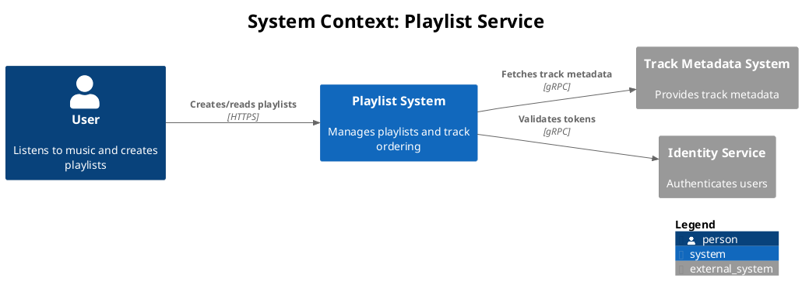
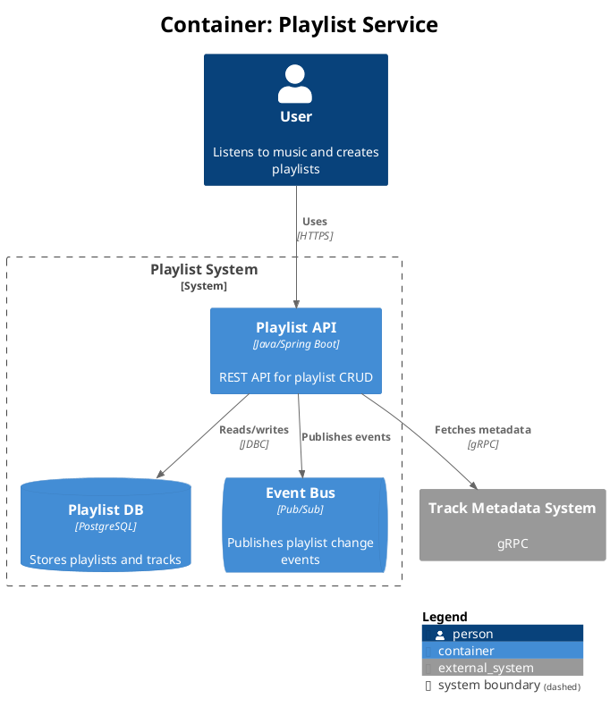
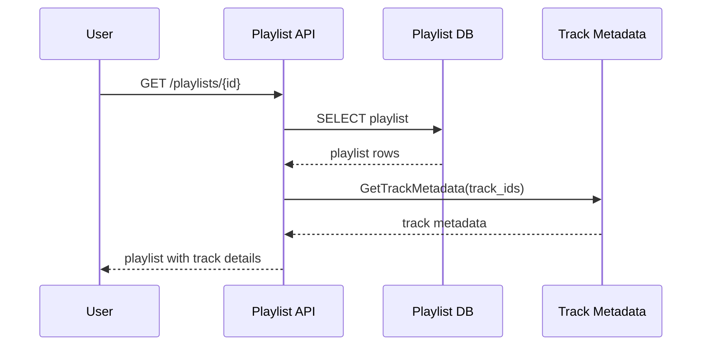

# C4 Format Reference

Structurizr DSL (primary) and PlantUML C4 (secondary) syntax, element vocabulary, layout
control, and sequence diagram patterns.

## Section 1 — Structurizr DSL (Primary Format)

Key concepts:

- `workspace` block contains `model` (elements + relationships) and `views` (diagram configs)
- Define each element ONCE; all diagram views are generated from the single model
- `!include other-repo/architecture.dsl` for multi-repo composition
- `autoLayout lr` / `autoLayout tb` — no manual positioning needed

### Complete Working Example

```
workspace "Playlist Service" {
    model {
        user = person "User" "Listens to music and creates playlists"

        playlistSystem = softwareSystem "Playlist System" {
            webApi = container "Playlist API" "REST API for playlist CRUD" "Java/Spring Boot"
            db = container "Playlist DB" "Stores playlists and tracks" "PostgreSQL" {
                tags "Database"
            }
            cache = container "Redis Cache" "Caches hot playlists" "Redis" {
                tags "Cache"
            }
        }

        trackSystem = softwareSystem "Track Metadata System" "External" {
            tags "External System"
        }

        user -> webApi "Creates/reads playlists" "HTTPS"
        webApi -> db "Reads/writes" "JDBC"
        webApi -> cache "Reads/writes hot data" "Redis protocol"
        webApi -> trackSystem "Fetches track metadata" "gRPC"
    }

    views {
        systemContext playlistSystem "SystemContext" {
            include *
            autoLayout lr
        }
        container playlistSystem "Containers" {
            include *
            autoLayout tb
        }
    }
}
```

### Multi-Repo `!include` Pattern

```
workspace "Music Platform" {
    model {
        !include playlist-service/docs/architecture/model.dsl
        !include track-service/docs/architecture/model.dsl
        # Cross-system relationships defined here
        playlistApi -> trackApi "Fetches metadata" "gRPC"
    }
}
```

---

## Section 2 — PlantUML C4 Element Vocabulary (Secondary Format)

PlantUML with [C4-PlantUML](https://github.com/plantuml-stdlib/C4-PlantUML) stdlib. The
`structurizr-cli export -f plantuml/c4plantuml` command generates this format automatically
from `workspace.dsl`.

### Stdlib Includes

Use the PlantUML stdlib (bundled with PlantUML, no URL needed):

```
!include <C4/C4>
!include <C4/C4_Context>
!include <C4/C4_Container>
!include <C4/C4_Component>
```

### Element Reference

| Element             | Syntax                                                      | Used in    |
| ------------------- | ----------------------------------------------------------- | ---------- |
| Person              | `Person(alias, label, $descr="")`                           | All levels |
| External Person     | `Person_Ext(alias, label, $descr="")`                       | All levels |
| System              | `System(alias, label, $descr="")`                           | Context    |
| External System     | `System_Ext(alias, label, $descr="")`                       | Context    |
| Database System     | `SystemDb(alias, label, $descr="")`                         | Context    |
| Queue System        | `SystemQueue(alias, label, $descr="")`                      | Context    |
| Container           | `Container(alias, label, $techn="", $descr="")`             | Container+ |
| DB Container        | `ContainerDb(alias, label, $techn="", $descr="")`           | Container+ |
| Queue Container     | `ContainerQueue(alias, label, $techn="", $descr="")`        | Container+ |
| Component           | `Component(alias, label, $techn="", $descr="")`             | Component  |
| System Boundary     | `System_Boundary(alias, label) { ... }`                     | All        |
| Container Boundary  | `Container_Boundary(alias, label) { ... }`                  | All        |
| Enterprise Boundary | `Enterprise_Boundary(alias, label) { ... }`                 | Context    |
| Relationship        | `Rel(from, to, label, $techn="")`                           | All        |
| Bidirectional       | `BiRel(from, to, label)`                                    | All        |
| Directional         | `Rel_U / Rel_D / Rel_L / Rel_R(from, to, label, $techn="")` | All        |

### Working C4Context Example (Level 1)



### Working C4Container Example (Level 2)



---

## Section 3 — PlantUML C4 Layout Control

PlantUML uses Graphviz (DOT) for automatic layout. Unlike Mermaid, it handles edge routing
and label placement automatically. For fine-tuning, use these controls:

### Global Layout Direction

| Directive                 | Effect                                                         |
| ------------------------- | -------------------------------------------------------------- |
| `top to bottom direction` | Default. Elements flow top-to-bottom.                          |
| `left to right direction` | Elements flow left-to-right. Good for system context diagrams. |

### Directional Relationship Hints

Directional `Rel` variants influence element positioning:

| Variant                  | Effect                     |
| ------------------------ | -------------------------- |
| `Rel_D(from, to, label)` | Place `to` below `from`    |
| `Rel_U(from, to, label)` | Place `to` above `from`    |
| `Rel_R(from, to, label)` | Place `to` right of `from` |
| `Rel_L(from, to, label)` | Place `to` left of `from`  |

### Invisible Layout Helpers

For positioning without visible arrows:

| Helper        | Effect                                      |
| ------------- | ------------------------------------------- |
| `Lay_D(a, b)` | Place `b` below `a` (no visible connection) |
| `Lay_R(a, b)` | Place `b` right of `a`                      |
| `Lay_U(a, b)` | Place `b` above `a`                         |
| `Lay_L(a, b)` | Place `b` left of `a`                       |

### Rendering from CLI

```bash
# Render single file
plantuml -tsvg diagram.puml

# Render all .puml files in a directory
plantuml -tsvg diagrams/*.puml

# Full pipeline from workspace.dsl
structurizr-cli export -f plantuml/c4plantuml -w workspace.dsl -o diagrams/
plantuml -tsvg diagrams/*.puml
```

### Tips

- Graphviz handles most layouts well automatically — only add hints when needed
- Use `Lay_*()` helpers sparingly; over-constraining can produce worse results
- Split diagrams with >10 elements into focused views rather than fighting layout
- The `structurizr-cli export` output is ready to render — no manual layout needed

---

## Section 4 — Sequence Diagram Patterns

For request-flow propagation across services (Mermaid `sequenceDiagram`):



Pattern note: combine a C4Container diagram with 1–3 sequence diagrams to capture
both static structure and dynamic request flows — this is the established pattern from
`2025-12-10-smart-assistant-c4-architecture.md`.
