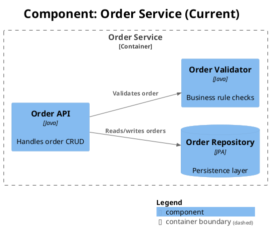

# Proposal Template Reference

This template defines the output format for Phase 4 (Document) of the refactor-architecture
skill. The proposal should be detailed enough that `/create-plan-tdd` can create a faithful
implementation plan from it, but written at a level humans can easily review. Write the
proposal to `~/.claude/thoughts/shared/refactor-proposals/YYYY-MM-DD-description.md`.

## Template

````markdown
---
date: YYYY-MM-DD
type: refactor-proposal
repository: [repo name]
status: draft
---

# Architectural Refactoring Proposal: [Title]

## Executive Summary
[2-3 sentences: what's wrong, what we propose, expected improvement]

## Problem Summary
[Numbered list of each problem. For each one include:
- Friction pattern classification (from friction-patterns.md)
- Coupling metrics (Ce, Ca, files-per-concept)
- Impact on readability and navigability]

## Architecture Comparison

### Current Architecture
[PlantUML C4 Component diagram of current state — see syntax guide below]

### Proposed Architecture
[PlantUML C4 Component diagram of proposed state]

### What Changed and Why
[Narrative connecting the two diagrams — what moved, what merged, what was extracted,
and the reasoning behind each change]

## Proposed Solution
[For each proposed module, specify:
- **Owns**: responsibilities this module takes on
- **Hides**: implementation details callers never see
- **Exposes**: interface contract (public API surface)

Include:
- Interface design with rationale for each boundary decision
- Dependency strategy per category (from dependency-categories.md)
- Testing strategy: new boundary tests to write, old shallow tests to delete]

## Honest Assessment

### Pros
[Concrete benefits with expected metrics improvement]

### Cons and Limitations
[What this doesn't solve, what gets harder, what complexity moves rather than disappears]

### Risks and Unknowns
[What could go wrong, what we're uncertain about]

## Next Steps
Run `/create-plan-tdd` with this proposal document path to generate an implementation plan.

## Optional Sections (include when relevant)
- **Recommended CLAUDE.md Updates** — if module boundaries change, list what to update
- **AI Navigability Improvement** — before/after files-per-concept and context budget metrics
````

## PlantUML C4 Syntax Guide

Use the PlantUML stdlib for C4 Component diagrams. Required include:

```
!include <C4/C4_Component>
```

Key elements at the Component level:

| Element | Syntax |
|---------|--------|
| Component | `Component(alias, label, $techn="", $descr="")` |
| DB Component | `ComponentDb(alias, label, $techn="", $descr="")` |
| Queue Component | `ComponentQueue(alias, label, $techn="", $descr="")` |
| Boundary | `Container_Boundary(alias, label) { ... }` |
| Relationship | `Rel(from, to, label, $techn="")` |
| Directional | `Rel_D(from, to, label)` / `Rel_R`, `Rel_L`, `Rel_U` |

Minimal example:



For full C4 syntax, see the c4-architecture skill's `references/c4-formats.md`.

## Navigability Metrics Guide

Compute before/after metrics for the optional AI Navigability section.

**Files-per-concept** -- count how many files an AI agent must read to understand one concept:

```bash
# Count files touching a concept (e.g., "OrderValidation")
grep -rl "OrderValidation" src/ | wc -l
```

Lower is better. A refactoring that consolidates a concept from 12 files to 3 files
significantly reduces context load.

**Context budget** -- total bytes an agent must load to work on a module:

```bash
# Sum byte size of all files in a module
wc -c src/order-validation/*.java | tail -1
```

Compare before/after to show whether the refactoring reduces the context window cost
of working in that area of the codebase.
