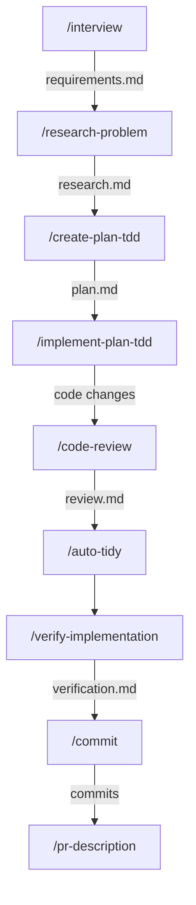
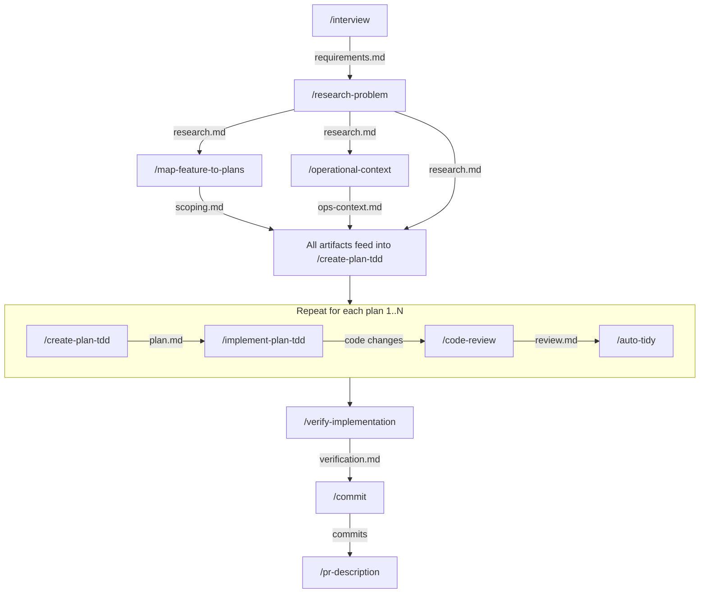

# feature-dev

Complete feature development workflow for Claude Code — from requirements gathering through implementation, review, and delivery.

## Common Workflows

### Basic Workflow (Known, Small Feature)

For features where the scope is well-understood and fits in a single implementation plan:

```
/interview → /research-problem → /create-plan-tdd → /implement-plan-tdd → /code-review → /auto-tidy → /verify-implementation → /commit → /pr-description
```



Each skill produces an artifact that feeds into the next:

1. `/interview` produces a requirements doc at `~/.claude/thoughts/shared/requirements/`
2. `/research-problem` reads the requirements and produces a research doc at `~/.claude/thoughts/shared/research/`
3. `/create-plan-tdd` reads the research and produces a TDD plan at `~/.claude/thoughts/shared/plans/`
4. `/implement-plan-tdd` reads the plan and produces code changes (with checkmarks tracking progress in the plan)
5. `/code-review` reviews the code changes and produces a review doc at `~/.claude/thoughts/shared/reviews/`
6. `/auto-tidy` autonomously improves test coverage, simplifies code, and applies formatting
7. `/verify-implementation` reads the plan and produces verification evidence at `~/.claude/thoughts/shared/verification/`
8. `/commit` creates structured git commits with AI co-authorship
9. `/pr-description` creates or updates a GitHub PR with a comprehensive description

### Advanced Workflow (Large Feature / Operational Context Needed)

When operational context is important and/or the feature might be too large for a single plan:

```
/interview → /research-problem → /map-feature-to-plans → /operational-context → [/create-plan-tdd → /implement-plan-tdd → /code-review → /auto-tidy] × N → /verify-implementation → /commit → /pr-description
```



Key differences from the basic workflow:

- **`/map-feature-to-plans`** analyzes the research doc and determines if the feature should be split into multiple implementation plans. It produces a scoping document with plan outlines, dependency graphs, and execution waves.
- **`/operational-context`** gathers production metrics, SLOs, dependency health, and deployment status for the target service(s).
- The artifacts from `/research-problem`, `/map-feature-to-plans`, AND `/operational-context` all feed into `/create-plan-tdd`.
- The middle block (`/create-plan-tdd` → `/implement-plan-tdd` → `/code-review` → `/auto-tidy`) repeats N times, where N is the number of plans determined by `/map-feature-to-plans`.

### Alternative Entry Point: /break-down-initiative

For very large initiatives (PRDs, RFCs, epics) that contain multiple independent features:

```
/break-down-initiative → [/interview → /research-problem → ...] × per feature
```

This decomposes a high-level document into independently-executable feature outlines using vertical slices. Each feature then enters its own full pipeline run (basic or advanced workflow).

### Non-Interactive Mode

All skills support `--non-interactive` mode for pipeline/automated use. In non-interactive mode, confirmation gates are skipped, decisions are made autonomously using decision-principles, and all autonomous decisions are logged with rationale.

---

## Skill Reference

### /interview

Gather requirements through structured questioning before automated research begins. Only asks questions that automated tools cannot answer (business motivation, acceptance criteria, scope tradeoffs).

**Key features**:

- Premise challenge — validates the problem is worth solving before diving into details
- Scope mode selection — MVP, Complete, or Ambitious
- Relentless tree-walking — explores every branch of the design tree, resolving dependencies one-by-one
- Context-sharing protocol — presents running mental model to build shared understanding
- Mutual understanding confirmation — only the user's explicit confirmation ends the interview

**Output**: `~/.claude/thoughts/shared/requirements/YYYY-MM-DD-description-requirements.md`

**Examples**:

```bash
/interview                                                    # Start interactive interview
/interview ~/.claude/thoughts/shared/tickets/ENG-1234.md      # Pre-load a ticket
/interview --non-interactive ~/.claude/thoughts/shared/tickets/ENG-1234.md  # Auto-generate requirements
```

### /research-problem

Conduct comprehensive research across the codebase and beyond by spawning parallel sub-agents and synthesizing their findings into a research document.

**Key features**:

- Decomposes research into questions with dependency analysis
- Spawns parallel sub-agents (codebase-explorer, web-search-researcher, domain experts)
- Batch execution with context passing between batches
- Iterative completeness review (max 2 iterations)
- Multi-persona review phase for Medium/Complex research (Gap Analyst, Devil's Advocate, Source Critic, Coherence Reviewer, Scope Guardian)
- Documentarian principle — documents what IS, not what SHOULD BE

**Output**: `~/.claude/thoughts/shared/research/YYYY-MM-DD-description.md`

**Examples**:

```bash
/research-problem How does the search ranking pipeline work?
/research-problem ~/.claude/thoughts/shared/requirements/2026-03-28-new-feature-requirements.md
/research-problem --non-interactive How does authentication work in this service?
```

### /map-feature-to-plans

Analyze a research document for a single feature and determine whether it should be split into multiple implementation plans.

**Key features**:

- Automated splitting heuristics: size (>600 LOC or >10 files), domain crossings (>2 boundaries), context budget (>50% context window), risk isolation
- Produces plan outlines with file lists, dependency graphs, and execution waves
- Adaptive PR strategy (single PR <500 LOC, stacked PRs 500-1500 LOC, re-scope >1500 LOC)
- No-op pass-through when splitting is unnecessary (common case)
- Redirects to `/break-down-initiative` if input is multi-feature

**Output**: `~/.claude/thoughts/shared/scoping/YYYY-MM-DD-description.md`

**Examples**:

```bash
/map-feature-to-plans ~/.claude/thoughts/shared/research/2026-03-28-search-feature.md
/map-feature-to-plans --non-interactive ~/.claude/thoughts/shared/research/2026-03-28-search-feature.md
```

### /operational-context

Gather operational context (metrics, SLOs, dependencies, deployment health) for service components to inform feature planning with real production data.

**Key features**:

- Accepts component names, system names, or team names
- Spawns parallel data-collector agents per component
- Collects: latency (P50/P95/P99), error rates, RPS, CPU/memory utilization, SLO status, dependency health, deployment history, active alerts, recent incidents
- Calculates risk assessment: error budget headroom, latency headroom, resource headroom, stability classification
- Decision mapping table linking operational data to planning decisions (e.g., "P99 + new call P99 must be < upstream timeout")

**Output**: `~/.claude/thoughts/shared/operational-context/<component>/YYYY-MM-DD.md`

**Examples**:

```bash
/operational-context my-service
/operational-context my-service my-other-service --non-interactive --time-window 7d
/operational-context "My Team" --non-interactive
```

### /create-plan-tdd

Create detailed TDD implementation plans with wave-based parallelism and multi-persona review.

**Key features**:

- Test-Driven Development methodology: every task follows Red-Green-Refactor cycle
- Wave 0 for shared test infrastructure setup
- Wave-based parallelism: tasks within a wave have no mutual dependencies
- Domain and language detection for specialized agents
- Context gathering with parallel research agents
- Multi-persona review loop (TDD Methodology reviewer + others based on plan characteristics)
- Consumes research docs, scoping docs, and operational context docs as inputs

**Output**: `~/.claude/thoughts/shared/plans/YYYY-MM-DD-description.md`

**Examples**:

```bash
/create-plan-tdd
/create-plan-tdd ~/.claude/thoughts/shared/research/2026-03-28-search-feature.md
/create-plan-tdd --non-interactive ~/.claude/thoughts/shared/research/2026-03-28-search-feature.md
```

### /implement-plan-tdd

Execute TDD implementation plans with wave-based parallel agents and worktree isolation.

**Key features**:

- Spawns separate RED and GREEN agents per task for strict TDD enforcement
- RED phase: parallel failing-test agents in isolated worktrees → merge
- GREEN phase: parallel implementation agents in isolated worktrees → merge
- Integration check after each wave
- Spec compliance review verifying implementation matches plan
- Resume-safe: checkmarks in the plan track progress
- Agent status protocol: DONE, DONE_WITH_CONCERNS, BLOCKED, NEEDS_CONTEXT
- Final code quality review with language-specific simplification reviewers

**Output**: Code changes with checkmarked plan file

**Examples**:

```bash
/implement-plan-tdd ~/.claude/thoughts/shared/plans/2026-03-28-search-feature.md
/implement-plan-tdd --non-interactive ~/.claude/thoughts/shared/plans/2026-03-28-search-feature.md
```

### /code-review

Comprehensive multi-agent code review covering bugs, security, simplification, test quality, and holistic review.

**Key features**:

- Phase 1 (Context): gathers codebase patterns, conventions, sibling implementations, operational context
- Phase 2 (Review): spawns parallel specialist agents — bug-catcher, security-reviewer, language-specific simplification/test reviewers, general-code-reviewer, domain experts
- Phase 3 (Post-Review): sequential calibration (adversarial verification against actual code) and deduplication
- Configurable severity filtering: default MEDIUM+, `--all-severities`, `--strict-severity` (HIGH+CRITICAL only)
- Structured finding schema enabling automated PR comment submission via `/crit-pr-review`

**Output**: `~/.claude/thoughts/shared/reviews/review_<PR>_<DATE>.md`

**Examples**:

```bash
/code-review 123                      # Review PR #123
/code-review my-feature-branch        # Review a branch
/code-review 123 --all-severities     # Include LOW findings
/code-review 123 --strict-severity    # Only HIGH+CRITICAL
```

### /auto-tidy

Non-interactive, autonomous code tidy-up with test enhancement, code simplification, and formatting.

**Key features**:

- Fully autonomous — no user prompts, all decisions logged with rationale
- 10-step pipeline: pre-flight → scope extraction → domain detection → agent contract → test enhancement → source simplification → test simplification → data annotation review → coding guidelines → formatting → verification
- Checkpoint-and-revert strategy: each step creates a checkpoint commit; reverts on test failure
- Change-level scope enforcement: only analyzes code within the diff
- Decision framework: CRITICAL/HIGH always implement, MEDIUM/LOW use agent judgment

**Output**: Multiple atomic commits (tests, simplification, annotations, guidelines, formatting)

**Examples**:

```bash
/auto-tidy                            # Tidy changes on current branch
/auto-tidy --branch master            # Compare against master
/auto-tidy --staged                   # Only staged changes
/auto-tidy src/main/java/com/example/ # Specific directory
```

> **Note**: `/tidy` is the interactive variant that asks for user confirmation at each step. `/auto-tidy` is the non-interactive variant for pipeline use.

### /verify-implementation

Generate reproducible verification evidence that an implementation plan was correctly executed.

**Key features**:

- Parses plan for testable assertions (command-based, behavioral, negative)
- Objective alignment check: maps every plan item to implementation evidence (PASS/FAIL/GAP)
- **Live service testing** (Backend API domain): automatically starts the service, generates a test scenario matrix (happy path, full input, field omission, feature toggles, error inputs, graceful degradation, before/after), executes all scenarios via gRPC/REST, and records PASS/FAIL per scenario with full request/response transcripts
- Before/after comparisons for behavioral changes
- Generates standalone verification scripts
- Verdicts: PASS (all pass), FAIL (critical failure), PARTIAL (non-critical failures)
- Optional requirements alignment check when requirements doc is provided

**Output**: `~/.claude/thoughts/shared/verification/YYYY-MM-DD-description.md`

**Examples**:

```bash
/verify-implementation
/verify-implementation ~/.claude/thoughts/shared/plans/2026-03-28-search-feature.md
/verify-implementation <plan-path> --requirements <requirements-path>
```

### /commit

Create structured git commits with co-authorship attribution.

**Key features**:

- Reviews conversation history and git diff to understand what changed
- Groups related changes into logical commits
- Drafts descriptive commit messages in imperative mood
- Adds AI co-authorship attribution

**Output**: Git commits

**Examples**:

```bash
/commit                    # Interactive — presents plan and asks for confirmation
/commit --non-interactive  # Auto-commit without confirmation
```

### /pr-description

Generate comprehensive PR descriptions by analyzing changes between current branch and target branch.

**Key features**:

- Analyzes git diff, commit history, and changed files
- Auto-detects breaking changes, feature flags, performance-sensitive areas
- Complexity analysis: auto-generates Mermaid architecture diagrams for complex PRs (>500 lines + >5 files, or >15 files, or >=3 new source files)
- Discovers and follows repo-specific PR templates
- Embeds verification results from `/verify-implementation` if available
- Creates or updates the GitHub PR via `gh` CLI
- Collapsible sections for detailed examples

**Output**: GitHub PR (created or updated)

**Examples**:

```bash
/pr-description                # Default: compare against master
/pr-description develop        # Compare against develop branch
/pr-description --no-diagram   # Skip diagram generation
/pr-description --non-interactive  # Auto-push unpushed branches
```

### /break-down-initiative

Decompose a PRD, RFC, epic, or high-level initiative into independently-executable feature outlines using vertical slices.

**Key features**:

- Validates input level: redirects to `/map-feature-to-plans` if input is already a single-feature research doc
- Explores codebase to understand architecture and domain boundaries
- Slices by user value (vertical), not by code module (horizontal)
- Each feature classified as HITL (needs human decision) or AFK (fully automatable)
- Dependency mapping between features
- Each output feature enters its own full pipeline run

**Output**: `~/.claude/thoughts/shared/decomposition/YYYY-MM-DD-description.md`

**Examples**:

```bash
/break-down-initiative
/break-down-initiative ~/.claude/thoughts/shared/prd/search-redesign.md
/break-down-initiative --non-interactive ~/.claude/thoughts/shared/prd/search-redesign.md
```

---

## Agents (13)

- **Research**: codebase-explorer, thoughts-explorer, web-search-researcher
- **Code review**: general-code-reviewer, bug-catcher, security-reviewer, review-calibrator, review-deduplicator, visual-aid-recommender
- **Language-specific reviewers**: python-code-simplification-reviewer, python-test-reviewer, typescript-code-simplification-reviewer, typescript-test-reviewer

## Prerequisites

### Optional

- Set `CLAUDE_CODE_EXPERIMENTAL_AGENT_TEAMS=1` in `~/.claude/settings.json` under `env` for agent team features
