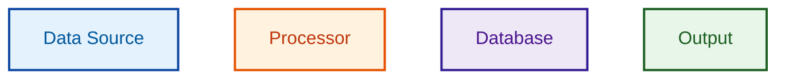

# Color Palette and Styling Standards

## Recommended Palette: Enhanced Material Design

Use this palette for all Mermaid diagrams to ensure consistency, accessibility, and professional appearance.

**Note on Material Design 3 (MD3)**: Google's MD3 introduces the HCT (Hue, Chroma, Tone) color system with a 13-tone scale for more nuanced color generation. While MD3 is the future direction for Google's design systems, the MD2 50-900 scale used here remains valid and simpler for diagram coloring. Consider MD3 HCT for future-facing projects requiring dynamic color theming.

### Semantic Color Mapping (use consistently across all diagrams)

```yaml
# Data Sources / Inputs (Blue family)
input_fill:     "#E3F2FD"  # Blue 50 - Light background
input_stroke:   "#0D47A1"  # Blue 900 - Dark border
input_text:     "#01579B"  # Blue 900 alt - Dark text

# Loaders / Processing / Transform (Orange family)
process_fill:   "#FFF3E0"  # Orange 50
process_stroke: "#E65100"  # Orange 900
process_text:   "#BF360C"  # Deep Orange 900

# Extraction / Business Logic (Purple family)
extract_fill:   "#F3E5F5"  # Purple 50
extract_stroke: "#4A148C"  # Purple 900
extract_text:   "#311B92"  # Deep Purple 900

# Converters / Control Logic (Pink family)
convert_fill:   "#FCE4EC"  # Pink 50
convert_stroke: "#880E4F"  # Pink 900
convert_text:   "#880E4F"  # Pink 900

# Outputs / Results (Green family)
output_fill:    "#E8F5E9"  # Green 50
output_stroke:  "#1B5E20"  # Green 900
output_text:    "#1B5E20"  # Green 900

# Storage / Database (Deep Purple family)
storage_fill:   "#EDE7F6"  # Deep Purple 50
storage_stroke: "#311B92"  # Deep Purple 900
storage_text:   "#4A148C"  # Purple 900

# External Systems / Infrastructure (Gray family)
neutral_fill:   "#FAFAFA"  # Gray 50
neutral_stroke: "#212121"  # Gray 900
neutral_text:   "#212121"  # Gray 900

# Security / Critical (Red family)
security_fill:  "#FFEBEE"  # Red 50
security_stroke: "#B71C1C"  # Red 900
security_text:   "#B71C1C"  # Red 900

# Background elements
background:     "#FFFFFF"  # White
border_light:   "#E0E0E0"  # Gray 300
```

## Mermaid classDef Templates

### Standard Template for Flowcharts


### Minimal Template (for simple diagrams with 3-4 component types)
```mermaid
classDef inputClass fill:#E3F2FD,stroke:#0D47A1,color:#01579B,stroke-width:2px
classDef processClass fill:#FFF3E0,stroke:#E65100,color:#BF360C,stroke-width:2px
classDef outputClass fill:#E8F5E9,stroke:#1B5E20,color:#1B5E20,stroke-width:2px
```

## Semantic Conventions

### By Component Type (industry standard patterns)

| Component Type | Color Family | Use For |
|----------------|--------------|---------|
| Data Sources / Inputs | Blue (#0D47A1) | External data, user input, API requests, raw data |
| Processing / Transform | Orange (#E65100) | Business logic, data transformation, computation |
| Extraction / Analysis | Purple (#4A148C) | Data extraction, parsing, analysis steps |
| Converters / Control | Pink (#880E4F) | Format converters, routing logic, orchestration |
| Outputs / Results | Green (#1B5E20) | Final results, API responses, success states |
| Storage / Database | Deep Purple (#311B92) | Databases, caches, persistent storage |
| External / Infrastructure | Gray (#212121) | External services, infrastructure, generic components |
| Security / Critical | Red (#B71C1C) | Authentication, authorization, critical paths, errors |

### By Architectural Layer

| Layer | Color | Use For |
|-------|-------|---------|
| Presentation | Light Blue (#BBDEFB) | UI, frontend, user-facing components |
| Application | Light Orange (#FFE0B2) | API layer, application logic |
| Business Logic | Light Green (#C8E6C9) | Core business rules, domain logic |
| Data | Light Purple (#E1BEE7) | Data access, persistence layer |
| Infrastructure | Light Gray (#EEEEEE) | Hosting, networking, deployment |

### By State/Status

| State | Color | Use For |
|-------|-------|---------|
| Active/Running | Green (#4CAF50) | Active services, running processes, success |
| Pending/Processing | Blue (#2196F3) | In-progress, waiting, queued |
| Warning/Attention | Amber (#FFC107) | Warnings, caution, degraded state |
| Error/Failed | Red (#F44336) | Errors, failures, critical issues |
| Inactive/Stopped | Gray (#9E9E9E) | Disabled, stopped, archived |

## Styling Best Practices

**DO:**
- Use semantic color mapping consistently across all diagrams
- Limit palette to 5-7 distinct colors per diagram
- Use stroke-width:2px for all nodes (consistency)
- Include text labels in addition to colors
- Test critical color combinations with contrast checker
- Use 900-level Material Design colors for text (not generic dark gray)
- **Include a legend for every diagram with 2+ colors/shapes**

**DON'T:**
- Mix red and green for adjacent components (colorblind issue)
- Use color as the only information carrier
- Use pure black (#000000) for text (can be harsh, use #212121)
- Exceed 7 colors in a single diagram
- Use custom colors without verifying WCAG contrast ratios
- **Omit legend when diagram uses multiple colors or shapes**
