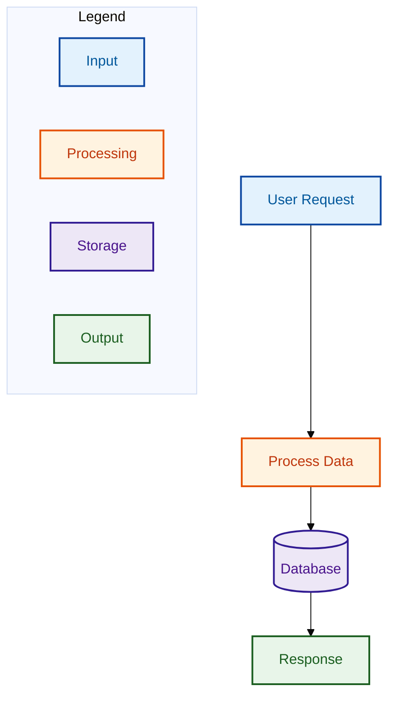

# Legend Requirements

**Every diagram with 2+ colors/shapes MUST include a legend** explaining what each color and shape represents. This is critical for accessibility and clarity.

## Legend Placement Options

### 1. Mermaid Subgraph Legend (preferred for flowcharts)
```mermaid
subgraph Legend
    direction LR
    L1[Input/Data Source]:::inputClass
    L2[Processing]:::processClass
    L3[Output/Result]:::outputClass
    L4[(Database)]:::storageClass
end
```

### 2. Mermaid Note-based Legend (for sequence diagrams)
```mermaid
Note over Legend: Color Key
Note over Legend: Blue = Input/Request
Note over Legend: Orange = Processing
Note over Legend: Green = Output/Response
```

### 3. Separate Legend Section (when inline legend clutters the diagram)
Include a markdown table immediately after the diagram code:

```markdown
**Legend:**
| Color | Shape | Meaning |
|-------|-------|---------|
| Blue (#E3F2FD) | Rectangle | Input / Data Source |
| Orange (#FFF3E0) | Rectangle | Processing / Transform |
| Green (#E8F5E9) | Rectangle | Output / Result |
| Purple (#EDE7F6) | Cylinder | Database / Storage |
```

## Legend Content Requirements
- List ALL colors used in the diagram with their semantic meaning
- List ALL shapes used if different shapes have different meanings
- Use the same color codes as the diagram for consistency
- Keep legend entries concise (2-4 words per meaning)
- Position legend so it doesn't interfere with the main diagram flow

## Example Complete Diagram with Legend

