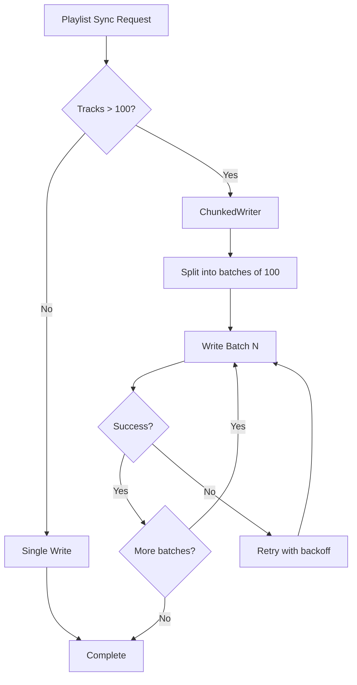

# Generate PR Description

Analyze the git changes between the current branch and the target branch (default: master) to generate a comprehensive pull request description.

## Instructions

**Important Note about `~/.claude/thoughts` directory**:
- You MAY use information from the `~/.claude/thoughts` directory to provide additional context for the PR description
- You MUST NOT commit or push any changes from the `~/.claude/thoughts` directory unless:
  - The changes are already in a committed state, OR
  - The user explicitly requests to include them
- When analyzing git changes, filter out or ignore uncommitted `~/.claude/thoughts/` changes in your PR description

## Arguments

- `[target-branch]` (optional): The branch to compare against. Default: `master`
- `--no-diagram` (optional): Skip diagram generation even if complexity thresholds are met
- `--non-interactive` (optional): Auto-push unpushed branches without asking

## Mode Detection

Parse `$ARGUMENTS` for the `--non-interactive` flag:
- If `$ARGUMENTS` contains `--non-interactive`: Set NON_INTERACTIVE mode
  - Auto-push unpushed branches without asking (Step 8)
  - All other behavior remains the same
- If `$ARGUMENTS` does not contain `--non-interactive`: Behave exactly as before (interactive mode)

1. **Fetch and analyze changes**:
   - Run `git fetch origin {{TARGET_BRANCH:-master}}`
   - Get diff summary: `git diff --name-status --stat origin/{{TARGET_BRANCH:-master}}...HEAD`
   - Get commit history: `git log --oneline --no-merges origin/{{TARGET_BRANCH:-master}}..HEAD`
   - Get changed files list: `git diff --name-only origin/{{TARGET_BRANCH:-master}}...HEAD`
   - Check for linked issues: `git log --grep="#[0-9]" --grep="fixes" --grep="closes" -i origin/{{TARGET_BRANCH:-master}}..HEAD`

2. **Analyze PR complexity for diagram generation** (skip if `--no-diagram` was specified):

   Calculate the following metrics using the git diff from step 1:

   ```bash
   # Lines changed
   ADDITIONS=$(git diff --numstat origin/{{TARGET_BRANCH:-master}}...HEAD | awk '{sum+=$1} END {print sum+0}')
   DELETIONS=$(git diff --numstat origin/{{TARGET_BRANCH:-master}}...HEAD | awk '{sum+=$2} END {print sum+0}')
   TOTAL_LINES=$((ADDITIONS + DELETIONS))

   # Files changed
   CHANGED_FILES=$(git diff --name-only origin/{{TARGET_BRANCH:-master}}...HEAD | wc -l | tr -d ' ')

   # New source files (potential new components)
   NEW_MAIN_FILES=$(git diff --name-only --diff-filter=A origin/{{TARGET_BRANCH:-master}}...HEAD | grep -E 'src/main/.*\.(java|scala|py|ts|tsx|js|jsx)$' | wc -l | tr -d ' ')
   ```

   **Complexity thresholds** - Generate diagrams if ANY of these conditions are met:
   - `TOTAL_LINES > 500` AND `CHANGED_FILES > 5`
   - `CHANGED_FILES > 15` (regardless of line count)
   - `NEW_MAIN_FILES >= 3` (new classes/components in main source)

   **Exclusion criteria** - Skip diagrams if ALL changed files match these patterns:
   - Config-only: `.conf`, `.yaml`, `.yml`, `.json`, `.properties`, `.xml`, `.toml`
   - Test-only: Files in `**/test/**`, `**/tests/**`, `**/*Test.*`, `**/*Spec.*`
   - Documentation-only: `.md`, `.rst`, `docs/**`, `README*`
   - Dependency-only: `pom.xml`, `build.sbt`, `package.json`, `requirements.txt`, `Cargo.toml`
   - Simple hotfix: Single file with `TOTAL_LINES < 100`

   **Check exclusion criteria**:
   ```bash
   # Get list of changed files
   CHANGED_FILE_LIST=$(git diff --name-only origin/{{TARGET_BRANCH:-master}}...HEAD)

   # Check if all files match exclusion patterns
   EXCLUDED_PATTERNS="^\.(conf|yaml|yml|json|properties|xml|toml)$|/test/|/tests/|Test\.|Spec\.|\.md$|\.rst$|^docs/|^README|^pom\.xml$|^build\.sbt$|^package\.json$|^requirements\.txt$|^Cargo\.toml$"

   NON_EXCLUDED_FILES=$(echo "$CHANGED_FILE_LIST" | grep -vE "$EXCLUDED_PATTERNS" | wc -l | tr -d ' ')
   ```

   **Decision logic**:
   ```
   GENERATE_DIAGRAM = (
     NOT --no-diagram flag present
     AND NON_EXCLUDED_FILES > 0
     AND (
       (TOTAL_LINES > 500 AND CHANGED_FILES > 5) OR
       (CHANGED_FILES > 15) OR
       (NEW_MAIN_FILES >= 3)
     )
   )
   ```

   **Output for visibility** (show to user):
   ```
   ## PR Complexity Analysis

   | Metric | Value | Threshold |
   |--------|-------|-----------|
   | Total lines changed | [TOTAL_LINES] | > 500 |
   | Files changed | [CHANGED_FILES] | > 5 (with lines) or > 15 |
   | New source files | [NEW_MAIN_FILES] | >= 3 |

   **Diagram generation**: [Will generate / Skipped - reason]
   ```

3. **Auto-detect key information**:
   - **Breaking changes**: Look for changes in `api/`, `proto/`, public interfaces, database migrations
   - **Feature flags**: Search for feature flag patterns in the diff
   - **Performance-sensitive**: Changes in hot paths, caching, database queries, algorithms
   - **Tests**: Count added/modified test files
   - **Documentation**: Check for README, CHANGELOG, or docs/ changes

4. **Generate architecture diagram** (only if GENERATE_DIAGRAM is true):

   If the complexity analysis determined a diagram should be generated, spawn the visual-aid-recommender agent:

   **Gather context for the diagram prompt**:
   - Summarize the key changes from the diff (focus on new files and major modifications)
   - Identify the main entry points or components being added/modified
   - Note any new integrations or dependencies

   **Spawn visual-aid-recommender** using the Task tool:

   Prompt template:
   ```
   Analyze this PR to generate 1-2 diagrams that help explain the code changes.

   ## PR Context
   - Title: {{SUGGESTED_PR_TITLE}}
   - Files changed: {{CHANGED_FILES}}
   - Lines: +{{ADDITIONS}} -{{DELETIONS}}

   ## Summary of Changes
   {{SUMMARY_OF_KEY_CHANGES}}

   ## New/Modified Files of Interest
   {{LIST_OF_KEY_NEW_OR_MODIFIED_FILES}}

   ## Requirements
   1. Generate at most 2 diagrams (preferably 1 if it captures the essence)
   2. Use Mermaid syntax (renders natively in GitHub)
   3. Focus on HIGH-LEVEL flow, not implementation details
   4. Prefer flowcharts for business logic, sequence diagrams for service integrations
   5. Keep diagrams simple enough to read without zooming (max 10-15 nodes)
   6. Include a brief caption for each diagram explaining what it shows
   7. Do NOT include accessibility metadata (alt text, long description) - just the diagram and caption

   ## Output Format
   For each diagram, provide:

   ### Diagram [N]: [Brief Title]
   **Caption**: [1-2 sentence explanation of what this diagram shows]

   ```mermaid
   [Complete Mermaid diagram code]
   ```
   ```

   **Wait for the agent to complete** before proceeding to step 5.

   **Extract diagram output**:
   - Parse the visual-aid-recommender's response for the diagram code and captions
   - Store for inclusion in the PR description

5. **Discover PR template**:
   - Use the `codebase-explorer` agent to search for pull request template files
   - Common locations include:
     - `.github/pull_request_template.md`
     - `.github/PULL_REQUEST_TEMPLATE.md`
     - `.github/PULL_REQUEST_TEMPLATE/`
     - `docs/pull_request_template.md`
     - `PULL_REQUEST_TEMPLATE.md`
   - Prompt for the agent: "Find pull request template files in this repository. Look for files like pull_request_template.md, PULL_REQUEST_TEMPLATE.md, or similar PR template files in .github/, docs/, or root directory."
   - If a template is found:
     - Read the template file(s)
     - Use the template structure to generate the PR description
     - Fill in the template sections based on the analyzed changes
     - Maintain the template's formatting, sections, and style
     - **If diagrams were generated**: Insert an "Architecture Overview" section in an appropriate location:
       - After "Summary" or "Context" sections if they exist
       - Before "Testing" or "Checklist" sections if they exist
       - Use judgment to find the most logical placement within the template structure
       - If the template has a designated section for diagrams/visuals, use that
   - If no template is found:
     - Proceed with the default PR description format defined below

6. **Generate PR description**:
   - If using a discovered template: Follow the template's structure exactly
   - If using default format: Use these sections:

### Title
- Create a concise, outcome-focused title (<72 chars)
- Use imperative mood: "Add X", "Fix Y", "Refactor Z"
- Include measurable impact if applicable

### Summary
Brief 2-3 sentence overview of what this PR accomplishes and why it's needed.

### Context
- Problem being solved or feature being added
- User/system impact
- Link to related issues/tickets (auto-detect from commit messages)

### What Changed
Group changes by subsystem/area:
- **Core Logic**: Main business logic changes
- **API/Interface**: Public API modifications
- **Database**: Schema changes, migrations
- **Configuration**: Config file updates
- **Tests**: New or modified tests
- **Documentation**: Doc updates

For each group, provide 2-3 bullet points summarizing meaningful changes (not just file lists).

### Architecture Overview
[Include if diagrams were generated, otherwise omit this section entirely]

The following diagram illustrates the high-level [flow/architecture/structure] of this change:

```mermaid
[Diagram code from visual-aid-recommender]
```

[Caption explaining what the diagram shows]

[If a second diagram was generated, include it here with its caption]

### Behavioral Impact
- [ ] Breaking API changes: [Yes/No - list if yes]
- [ ] Database migrations: [Yes/No - describe if yes]
- [ ] Feature flags: [List any feature flags and their defaults]
- [ ] Configuration changes: [List any new/modified configs]

### Risk Assessment
- **Risk Level**: [Low/Medium/High]
- **Key Risks**: [List main risks]
- **Mitigations**: [How risks are addressed]
- **Rollback Plan**: [How to rollback if needed]

### Performance Impact
- Performance-sensitive areas touched: [Yes/No]
- Expected impact: [Describe if applicable]
- Benchmarks/metrics: [Include if available]

### Testing
- **Test Coverage**:
  - [ ] Unit tests added/updated
  - [ ] Integration tests added/updated
  - [ ] Manual testing completed
- **Test Instructions**: [Steps for manual testing if needed]

### Screenshots/Demo
[Include if UI changes, otherwise mark as N/A]

### Verification Results
[Include if a verification report exists at `~/.claude/thoughts/shared/verification/`, otherwise omit this section entirely]

<details>
<summary><strong>Verification Results: [VERDICT]</strong></summary>

| Category | Total | Pass | Fail | Skip |
|----------|-------|------|------|------|
| ... | ... | ... | ... | ... |

**Key Assertions:**
- PASS: [assertion 1]
- PASS: [assertion 2]
- ...

Full report: `~/.claude/thoughts/shared/verification/YYYY-MM-DD-description.md`

</details>

### Review Guidance
- **Start here**: [Most important file/component to review first]
- **Review order**: [Suggested sequence for reviewing files]
- **Focus areas**: [Specific areas needing careful review]

### Pre-merge Checklist
- [ ] Tests passing
- [ ] Documentation updated (if public API changed)
- [ ] CHANGELOG updated (if user-facing)
- [ ] Feature flags documented
- [ ] Migration tested (if applicable)
- [ ] Performance validated (if sensitive areas touched)

## Implementation Notes

When generating the description:
1. Keep bullet points concise and scannable
2. Use technical terms appropriately but explain complex changes
3. Highlight anything that might surprise reviewers
4. For large PRs, consider suggesting it be split
5. Auto-tick checklist items that can be verified from the diff
6. If the diff is huge (>1000 lines), focus on architectural changes over implementation details

## Diagram Generation

The skill automatically generates architecture diagrams for complex PRs to help reviewers understand the changes at a high level.

### When Diagrams Are Generated

Diagrams are generated when ANY of these complexity thresholds are met:
- More than 500 lines changed AND more than 5 files changed
- More than 15 files changed (regardless of line count)
- 3 or more new source files (Java, Scala, Python, TypeScript) added

### When Diagrams Are NOT Generated

Diagrams are skipped for:
- **Config-only changes**: Only `.conf`, `.yaml`, `.json`, `.properties` files changed
- **Test-only changes**: Only files in `test/` directories or test files changed
- **Documentation updates**: Only `.md`, `.rst`, or `docs/` files changed
- **Dependency updates**: Only `pom.xml`, `build.sbt`, `package.json`, etc. changed
- **Simple hotfixes**: Single file changes under 100 lines
- **User override**: When `--no-diagram` flag is specified

### Diagram Types

The skill generates:
- **Flowcharts**: For business logic with decision points (preferred)
- **Sequence diagrams**: For service-to-service integrations
- Maximum of 2 diagrams per PR to avoid overwhelming reviewers

### Handling Unhelpful Diagrams

If a generated diagram isn't helpful:
- Simply delete the "Architecture Overview" section from the PR description before publishing
- The diagram generation is best-effort; not all PRs benefit from visualization

## Collapsible Examples

When including detailed examples in PR descriptions, use HTML `<details>` tags to keep the description scannable while providing full details for interested reviewers.

### When to Use Collapsible Sections

Use `<details>/<summary>` for:
- API/gRPC request and response examples
- CLI commands with multi-line output (>5 lines)
- Code snippets demonstrating usage
- Verification scripts
- Detailed test results or data tables
- Manual verification evidence

Do NOT use collapsible sections for:
- Short examples (< 5 lines) that fit inline
- Critical information that all reviewers must see
- Simple bullet points or one-liner examples

### Formatting Guidelines

1. **Always bold the summary text** using `<strong>` tags
2. **Add a blank line** after the opening `<summary>` tag and before the closing `</details>` tag
3. **Use descriptive summaries** that tell reviewers what they'll find inside
4. **Include both input and output** when showing commands/requests

### Syntax Template

```html
<details>
<summary><strong>Descriptive Title Here</strong></summary>

**Request:**
\`\`\`bash
your-command --with flags
\`\`\`

**Response:**
\`\`\`json
{"example": "output"}
\`\`\`

</details>
```

### Good Summary Examples

| Content Type | Good Summary |
|--------------|--------------|
| API test | `API Response Verification` |
| gRPC call | `gRPC Request/Response Details` |
| CLI command | `CLI Command Output` |
| Script | `Verification Script` |
| Multiple tests | `Test Results (5 cases)` |
| Before/after | `Before and After Comparison` |
| Verification | `Verification Results: PASS` |

### Verification Results

When a verification report exists at `~/.claude/thoughts/shared/verification/`, the PR description automatically includes a collapsible Verification Results section. This section embeds:
- The verdict (PASS / FAIL / PARTIAL)
- The summary table with category counts
- Key PASS/FAIL assertion lines from verification examples
- A reference to the full local report for the author

When no verification report exists, no section is added. The full evidence document remains local at `~/.claude/thoughts/shared/verification/YYYY-MM-DD-description.md` for the author's reference.

## Embed Verification Results

7. **Check for verification reports and embed in the PR description**:
   - Check for verification reports: `ls -t ~/.claude/thoughts/shared/verification/2*.md 2>/dev/null | head -1`
   - If no report exists, skip this step entirely (no section added)
   - If a report exists, read it and extract:
     - The `## Verdict` line (PASS / FAIL / PARTIAL)
     - The `## Summary` table
     - The assertion lines (PASS/FAIL) from verification examples
   - Generate a `<details>` section matching the Verification Results template in the default format above
   - Insert the section:
     - In the default template: after "Testing" and before "Review Guidance"
     - In a discovered PR template: after the closest "Testing" equivalent section

## Create or Update PR

8. **After generating the description, create or update the PR in GitHub**:
   - First, check if the current branch is pushed to remote: `git rev-parse --abbrev-ref --symbolic-full-name @{u} 2>&1`
   - If the branch is not pushed to remote:
     **If in NON_INTERACTIVE mode:**
     - Push the branch automatically: `git push -u origin HEAD`
     - Log: "Auto-pushed branch to remote (non-interactive mode)"

     **If in interactive mode (default):**
     - Inform the user that the branch needs to be pushed
     - Ask: "Would you like me to push the branch to remote?"
     - If user responds with affirmative (yes/y/sure/ok/etc.), push the branch: `git push -u origin HEAD`
     - If user declines, stop and inform them they need to push manually before creating a PR
   - Check if a PR already exists for the current branch: `gh pr view --json number,url 2>&1`
   - If a PR exists:
     - Extract the PR number from the output
     - Update the PR body using: `gh pr edit <PR_NUMBER> --body "$(cat <<'EOF'\n<PR_DESCRIPTION>\nEOF\n)"`
     - Get the PR URL: `gh pr view --json url --jq .url`
   - If no PR exists:
     - Create a new PR: `gh pr create --title "<TITLE>" --body "$(cat <<'EOF'\n<PR_DESCRIPTION>\nEOF\n)" --base {{TARGET_BRANCH:-master}}`
     - The command will return the PR URL

   **Error Handling**:
   - If `gh` command is not available, inform the user and provide the raw markdown instead
   - If there are no commits ahead of the target branch, inform the user there's nothing to create a PR for
   - If authentication fails, inform the user they need to run `gh auth login`
   - For any other errors, explain what went wrong and provide the raw markdown as fallback

9. **Confirm success**:
   - If the PR was created/updated successfully, provide a confirmation message with the PR URL
   - Example: "PR description updated successfully: https://github.com/org/repo/pull/123"
   - If it failed, explain why and provide the raw markdown in triple backticks for manual copy-paste

## Example Output

```markdown
## Fix playlist sync batching to reduce API calls by 40%

### Summary
Refactors the playlist synchronization logic to batch write operations, significantly reducing API calls and improving sync performance for large playlists.

### Context
Users with playlists >500 tracks were experiencing timeouts during sync operations. This PR implements batched writes to handle large playlists efficiently.

Fixes #2847

### What Changed
**Core Logic**:
- Introduced `ChunkedWriter` class to batch items in groups of 100
- Modified `PlaylistSyncJob` to use batched operations
- Added retry logic with exponential backoff for failed batches

**Tests**:
- Added unit tests for `ChunkedWriter` batching logic
- Updated integration tests to verify large playlist handling
- Added performance benchmarks

### Architecture Overview

The following diagram shows the batched write flow in the new ChunkedWriter:



This shows how large playlists are chunked into batches of 100 tracks, with retry logic for failed batches.

### Behavioral Impact
- [ ] Breaking API changes: No
- [ ] Database migrations: No
- [ ] Feature flags: `playlist_batch_sync` (default: enabled)
- [ ] Configuration changes: New `batch_size` config (default: 100)

### Risk Assessment
- **Risk Level**: Medium
- **Key Risks**: Potential for partial sync failures in batches
- **Mitigations**: Each batch is atomic; failed batches are retried individually
- **Rollback Plan**: Disable `playlist_batch_sync` feature flag

### Performance Impact
- Performance-sensitive areas touched: Yes
- Expected impact: 40% reduction in API calls, 60% faster sync for playlists >500 tracks
- Benchmarks: p95 latency reduced from 2.1s to 850ms on staging

### Testing
- **Test Coverage**:
  - [x] Unit tests added/updated
  - [x] Integration tests added/updated
  - [x] Manual testing completed
- **Test Instructions**: Create playlist with 1000+ tracks and trigger sync

<details>
<summary><strong>Manual Verification Results</strong></summary>

**Test Case**: Large playlist sync (1500 tracks)

**Command:**
```bash
./scripts/test-sync.sh --playlist-size 1500 --verbose
```

**Result:**
```
Syncing playlist: my-large-playlist (1500 tracks)
Batch 1/15: 100 tracks synced in 0.8s
Batch 2/15: 100 tracks synced in 0.7s
...
Batch 15/15: 100 tracks synced in 0.9s
Total sync time: 12.3s (was: 28.7s before batching)
API calls: 15 (was: 1500 before batching)
```

</details>

### Review Guidance
- **Start here**: `ChunkedWriter.scala` - core batching logic
- **Review order**: ChunkedWriter -> PlaylistSyncJob -> tests
- **Focus areas**: Error handling in batch operations, retry logic correctness
```
