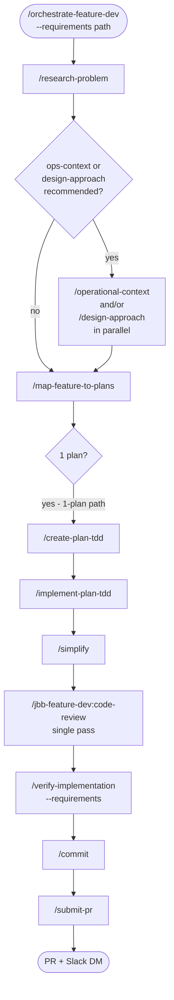
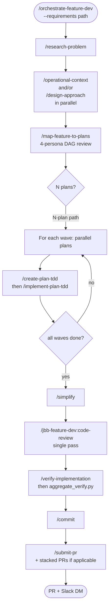
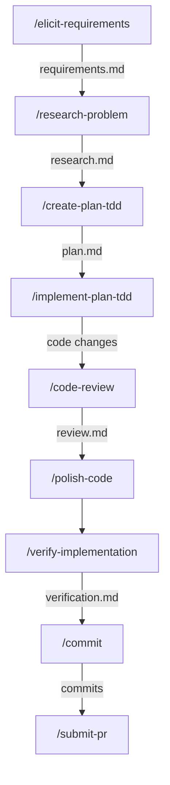
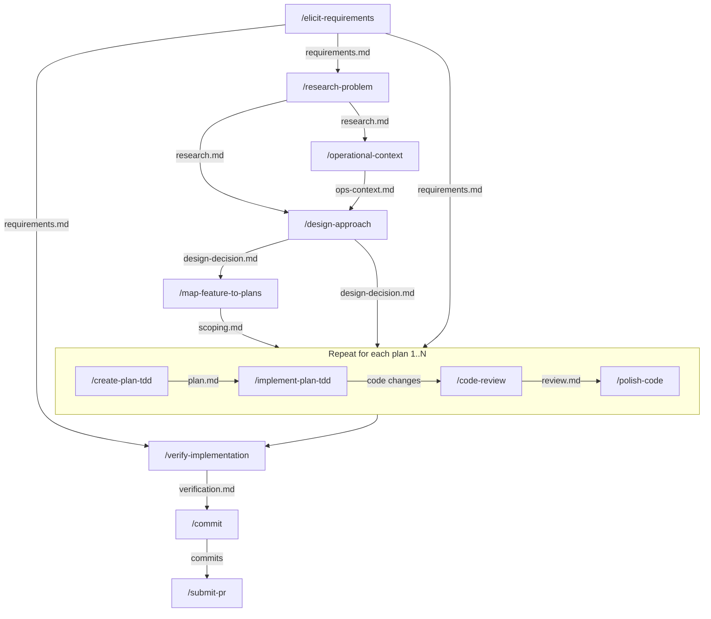

# jbb-feature-dev

Complete feature development workflow for Claude Code — from requirements gathering through implementation, review, and delivery.

## Installation

```bash
claude plugins add github.com/JonnyCBB/claude-code-config/plugins/jbb-feature-dev
```

## Common Workflows

### Orchestrated Workflow (recommended)

`/orchestrate-feature-dev` is an end-to-end pipeline that chains the individual skills below via `claude -p` per stage with context isolation. It is the recommended entry point once you have a requirements document. The orchestrator inspects the output of `/map-feature-to-plans` and follows one of two paths: a 1-plan path that runs a single create/implement/review/verify chain, or an N-plan path that fans out parallel waves of plans, runs the contract handshake (`/contract-check` and `/verify-contract`) per plan, and aggregates verification before submitting one or more PRs. State is persisted to `~/.claude/thoughts/shared/orchestrator-state/<run-id>.json` so partial runs are resumable. Reach for the orchestrator when you want the whole pipeline executed without per-stage babysitting; reach for the individual skills below when you need to drive a single stage manually or compose a non-standard sequence.





### Basic Workflow (Known, Small Feature)

For features where the scope is well-understood and fits in a single implementation plan:

```
/elicit-requirements → /research-problem → /create-plan-tdd → /implement-plan-tdd → /code-review → /polish-code → /verify-implementation → /commit → /submit-pr
```



Each skill produces an artifact that feeds into the next:

1. `/elicit-requirements` produces a requirements doc at `~/.claude/thoughts/shared/requirements/`
2. `/research-problem` reads the requirements and produces a research doc at `~/.claude/thoughts/shared/research/`
3. `/create-plan-tdd` reads the research and produces a TDD plan at `~/.claude/thoughts/shared/plans/`
4. `/implement-plan-tdd` reads the plan and produces code changes (with checkmarks tracking progress in the plan)
5. `/code-review` reviews the code changes and produces a review doc at `~/.claude/thoughts/shared/reviews/`
6. `/polish-code` refines test coverage, simplifies code, and applies formatting (use `--non-interactive` for autonomous mode)
7. `/verify-implementation` reads the plan and produces verification evidence at `~/.claude/thoughts/shared/verification/`
8. `/commit` creates structured git commits with AI co-authorship
9. `/submit-pr` creates or updates a GitHub PR with full lifecycle management (Jira, build monitoring, Slack notifications)

### Advanced Workflow (Large Feature / Operational Context Needed)

When operational context is important, design decisions need exploration, and/or the feature might be too large for a single plan:

```
/elicit-requirements → /research-problem → /operational-context → /design-approach → /map-feature-to-plans → [/create-plan-tdd → /implement-plan-tdd → /code-review → /polish-code] × N → /verify-implementation → /commit → /submit-pr
```



Key differences from the basic workflow:

- **`/operational-context`** gathers production metrics, SLOs, dependency health, and deployment status for the target service(s).
- **`/design-approach`** spawns competing architect agents to explore different design approaches, then facilitates structured decision-making. Can follow directly from `/research-problem` or from `/operational-context`. Produces a design decision document that constrains downstream planning.
- **`/map-feature-to-plans`** analyzes the research doc and determines if the feature should be split into multiple implementation plans. It consumes outputs from both `/operational-context` and `/design-approach`.
- The artifacts from `/research-problem`, `/design-approach`, `/map-feature-to-plans`, AND `/operational-context` all feed into `/create-plan-tdd`.
- The middle block (`/create-plan-tdd` → `/implement-plan-tdd` → `/code-review` → `/polish-code`) repeats N times, where N is the number of plans determined by `/map-feature-to-plans`.

### Alternative Entry Point: /break-down-initiative

For very large initiatives (PRDs, RFCs, epics) that contain multiple independent features:

```
/break-down-initiative → [/elicit-requirements → /research-problem → ...] × per feature
```

This decomposes a high-level document into independently-executable feature outlines using vertical slices. Each feature then enters its own full pipeline run (basic or advanced workflow).

### Non-Interactive Mode

All skills support `--non-interactive` mode for pipeline/automated use. In non-interactive mode, confirmation gates are skipped, decisions are made autonomously using decision-principles, and all autonomous decisions are logged with rationale.

---

## Skill Reference

### /orchestrate-feature-dev

End-to-end pipeline orchestrator for jbb-feature-dev. Chains research, planning, implementation, review, verification, and PR submission via `claude -p` per stage with context isolation. Honors the DAG produced by `/map-feature-to-plans`; runs the contract handshake per plan in N-plan mode; aggregates verify results into the PR body.

**Key features**:

- Named-arg CLI: `--prompt`, `--requirements`, `--skip-research`, `--design`, `--slack-channel`, `--ticket`, `--restart`, `--branch`
- 3 input modes: raw prompt; requirements only; requirements + design
- Research always runs unless `--skip-research` is explicitly supplied
- Conditional `/operational-context` + `/design-approach` (parallel when both recommended)
- `/simplify` once after all wave implementations, then a single `/jbb-feature-dev:code-review` pass — no fix loop and no severity gate. Findings are addressed by judgement, code-style findings are addressed by default even at Minor/Enhancement, and anything left unfixed is filed as a deferred bead
- Verify-fix loop after `/verify-implementation`
- Resumable via `~/.claude/thoughts/shared/orchestrator-state/<run-id>.json`
- Slack DM/channel routing via direct MCP
- Adaptive PR strategy: single PR or stacked PRs via `/rebase-stack`
- See `skills/orchestrate-feature-dev/references/` for the state-file schema, stage execution and model selection, agent prompts, escalation, Slack routing, and review-phase enforcement details.

**Output**: PR (or stacked PRs) submitted to GitHub with verification summary in the body; state file at `~/.claude/thoughts/shared/orchestrator-state/<run-id>.json`; per-stage logs at `~/.claude/thoughts/shared/orchestrator-state/logs/<run-id>/`.

**Examples**:

```bash
# Most common: requirements doc only
claude -p '/orchestrate-feature-dev --requirements ~/.claude/thoughts/shared/requirements/2026-05-04-feature.md'

# Resume after partial run
claude -p '/orchestrate-feature-dev --requirements <path>'  # picks up from state file

# Force full restart
claude -p '/orchestrate-feature-dev --requirements <path> --restart'

# Channel notification instead of DM
claude -p '/orchestrate-feature-dev --requirements <path> --slack-channel C0123456789'
```

### /elicit-requirements

Gather requirements through structured questioning before automated research begins. Spawns context-gathering agents when artifacts are provided. Only asks questions that automated tools cannot answer (business motivation, acceptance criteria, scope tradeoffs).

**Key features**:

- Context Sprint — detects artifacts in user input and spawns research agents before questioning
- Wave-based depth progression — Foundational → Nuances → Deep/Domain with synthesis checkpoints
- Premise challenge — validates the problem is worth solving before diving into details
- Scope mode selection — MVP, Complete, or Ambitious
- Relentless tree-walking — explores every branch of the design tree, resolving dependencies one-by-one
- Context-sharing protocol — presents running mental model to build shared understanding
- Mutual understanding confirmation — only the user's explicit confirmation ends the session

**Output**: `~/.claude/thoughts/shared/requirements/YYYY-MM-DD-description-requirements.md`

**Examples**:

```bash
/elicit-requirements                                                    # Start interactive interview
/elicit-requirements ~/.claude/thoughts/shared/tickets/ENG-1234.md      # Pre-load a ticket
/elicit-requirements --non-interactive ~/.claude/thoughts/shared/tickets/ENG-1234.md  # Auto-generate requirements
```

### /research-problem

Conduct comprehensive research across the codebase and beyond by spawning parallel sub-agents and synthesizing their findings into a research document.

**Key features**:

- Decomposes research into questions with dependency analysis
- Spawns parallel sub-agents (codebase-explorer, web-search-researcher, web-search-researcher, domain experts)
- Batch execution with context passing between batches
- Iterative completeness review (max 2 iterations)
- Multi-persona review phase for Medium/Complex research (Gap Analyst, Devil's Advocate, Source Critic, Coherence Reviewer, Scope Guardian)
- Documentarian principle — documents what IS, not what SHOULD BE

**Output**: `~/.claude/thoughts/shared/research/YYYY-MM-DD-description.md`

**Examples**:

```bash
/research-problem How does the search ranking pipeline work?
/research-problem ~/.claude/thoughts/shared/requirements/2026-03-28-new-feature-requirements.md
/research-problem --non-interactive How does authentication work in this service?
```

### /map-feature-to-plans

Analyze a research document for a single feature and determine whether it should be split into multiple implementation plans.

**Key features**:

- Automated splitting heuristics: size (>600 LOC or >10 files), domain crossings (>2 boundaries), context budget (>50% context window), risk isolation
- Produces plan outlines with file lists, dependency graphs, and execution waves
- Adaptive PR strategy (single PR <500 LOC, stacked PRs 500-1500 LOC, re-scope >1500 LOC)
- No-op pass-through when splitting is unnecessary (common case)
- Redirects to `/break-down-initiative` if input is multi-feature

**Output**: `~/.claude/thoughts/shared/scoping/YYYY-MM-DD-description.md`

**Examples**:

```bash
/map-feature-to-plans ~/.claude/thoughts/shared/research/2026-03-28-search-feature.md
/map-feature-to-plans --non-interactive ~/.claude/thoughts/shared/research/2026-03-28-search-feature.md
```

### /operational-context

Gather operational context (metrics, SLOs, dependencies, deployment health) for services to inform feature planning with real production data.

**Key features**:

- Accepts component names, system names, or team names
- Spawns parallel web-search-researcher agents per component
- Collects: latency (P50/P95/P99), error rates, RPS, CPU/memory utilization, SLO status, dependency health, deployment history, active alerts, recent incidents
- Calculates risk assessment: error budget headroom, latency headroom, resource headroom, stability classification
- Decision mapping table linking operational data to planning decisions (e.g., "P99 + new call P99 must be < upstream timeout")

**Output**: `~/.claude/thoughts/shared/operational-context/<component>/YYYY-MM-DD.md`

**Examples**:

```bash
/operational-context search-api
/operational-context search-api search-brain --non-interactive --time-window 7d
/operational-context "Search PA" --non-interactive
```

### /design-approach

Multi-architect design exploration before planning. Spawns competing architect agents with different perspectives to generate genuinely different approaches, presents them in a comparison document, then facilitates interactive discussion where the user explores tradeoffs and makes key design decisions.

**Key features**:

- Tension and settlement analysis — scans research docs for unresolved architectural tensions vs already-settled decisions
- Variable architect count (2-4 agents) based on the number of open tensions detected
- Competing perspectives — each architect embodies a coherent philosophy that resolves tensions differently
- Settlement compliance — validates architect outputs against settled decisions, stripping violations
- Convergence detection — if all architects agree, skips comparison and goes straight to decision document
- Structured decision tree — presents divergent decisions one by one with tradeoffs for user selection
- Requirements compliance — flags when a chosen option conflicts with a stated requirement
- Fallback perspectives (Minimal Changes / Clean Architecture / Pragmatic Balance) when tensions are unclear

**Output**: `~/.claude/thoughts/shared/feature_designs/YYYY-MM-DD-description.md`

**Examples**:

```bash
/design-approach ~/.claude/thoughts/shared/research/2026-03-28-search-feature.md
/design-approach ~/.claude/thoughts/shared/research/2026-03-28-search-feature.md --requirements=~/.claude/thoughts/shared/requirements/2026-03-28-requirements.md
/design-approach --non-interactive ~/.claude/thoughts/shared/research/2026-03-28-search-feature.md
```

### /create-plan-tdd

Create detailed TDD implementation plans with wave-based parallelism and multi-persona review.

**Key features**:

- Test-Driven Development methodology: every task follows Red-Green-Refactor cycle
- Wave 0 for shared test infrastructure setup
- Wave-based parallelism: tasks within a wave have no mutual dependencies
- Domain and language detection for specialized agents
- Context gathering with parallel research agents
- Multi-persona review loop (TDD Methodology reviewer + others based on plan characteristics)
- Consumes research docs, scoping docs, and operational context docs as inputs

**Output**: `~/.claude/thoughts/shared/plans/YYYY-MM-DD-description.md`

**Examples**:

```bash
/create-plan-tdd
/create-plan-tdd ~/.claude/thoughts/shared/research/2026-03-28-search-feature.md
/create-plan-tdd --non-interactive ~/.claude/thoughts/shared/research/2026-03-28-search-feature.md
```

### /implement-plan-tdd

Execute TDD implementation plans with wave-based parallel agents and worktree isolation.

**Key features**:

- Spawns separate RED and GREEN agents per task for strict TDD enforcement
- RED phase: parallel failing-test agents in isolated worktrees → merge
- GREEN phase: parallel implementation agents in isolated worktrees → merge
- Integration check after each wave
- Spec compliance review verifying implementation matches plan
- Resume-safe: checkmarks in the plan track progress
- Agent status protocol: DONE, DONE_WITH_CONCERNS, BLOCKED, NEEDS_CONTEXT
- Final code quality review with language-specific code style reviewers

**Output**: Code changes with checkmarked plan file

**Examples**:

```bash
/implement-plan-tdd ~/.claude/thoughts/shared/plans/2026-03-28-search-feature.md
/implement-plan-tdd --non-interactive ~/.claude/thoughts/shared/plans/2026-03-28-search-feature.md
```

### /code-review

Comprehensive multi-agent code review covering bugs, security, code style, test quality, and holistic review.

**Key features**:

- Phase 1 (Context): gathers codebase patterns, conventions, sibling implementations, operational context
- Phase 2 (Review): spawns parallel specialist agents — bug-catcher, security-reviewer, repo-rules-reviewer, language-specific code style/test reviewers, general-code-reviewer, domain experts
- Phase 3 (Post-Review): sequential calibration (adversarial verification against actual code) and deduplication
- Configurable severity filtering: default MEDIUM+, `--all-severities`, `--strict-severity` (HIGH+CRITICAL only)
- Structured finding schema enabling automated PR comment submission via `/crit-pr-review`

**Output**: `~/.claude/thoughts/shared/reviews/review_<PR>_<DATE>.md`

**Examples**:

```bash
/code-review 123                      # Review PR #123
/code-review my-feature-branch        # Review a branch
/code-review 123 --all-severities     # Include LOW findings
/code-review 123 --strict-severity    # Only HIGH+CRITICAL
```

### /polish-code

Final quality gate before `/submit-pr` with test enhancement, code simplification, data annotation review, coding guidelines, and formatting. Interactive by default; pass `--non-interactive` for autonomous mode that logs decisions instead of prompting.

**Key features**:

- 8-step pipeline: pre-flight → scope extraction → test enhancement → source simplification → test simplification → data annotation → coding guidelines → formatting → verification
- Checkpoint-and-revert strategy: each step creates a checkpoint commit; reverts on test failure
- Change-level scope enforcement: only analyzes code within the diff
- Decision framework (non-interactive): CRITICAL/HIGH always implement, MEDIUM/LOW use agent judgment
- Retry limit: 2 attempts when simplification breaks tests, then revert and continue

**Output**: Multiple atomic commits (tests, simplification, annotations, guidelines, formatting)

**Examples**:

```bash
/polish-code                                       # Tidy changes on current branch (interactive)
/polish-code --non-interactive                     # Autonomous mode — no prompts
/polish-code --branch master                       # Compare against master
/polish-code --staged                              # Only staged changes
/polish-code src/main/java/com/example/            # Specific directory
/polish-code --non-interactive --branch master     # Autonomous mode against master
```

### /verify-implementation

Generate reproducible verification evidence that an implementation plan was correctly executed.

**Key features**:

- Parses plan for testable assertions (command-based, behavioral, negative)
- Objective alignment check: maps every plan item to implementation evidence (PASS/FAIL/GAP)
- **Live service testing** (Backend API domain): automatically starts the service, generates a test scenario matrix (happy path, full input, field omission, feature toggles, error inputs, graceful degradation, before/after), executes all scenarios via gRPC/REST, and records PASS/FAIL per scenario with full request/response transcripts
- Before/after comparisons for behavioral changes
- Generates standalone verification scripts
- Verdicts: PASS (all pass), FAIL (critical failure), PARTIAL (non-critical failures)
- Optional requirements alignment check when requirements doc is provided

**Output**: `~/.claude/thoughts/shared/verification/YYYY-MM-DD-description.md`

**Examples**:

```bash
/verify-implementation
/verify-implementation ~/.claude/thoughts/shared/plans/2026-03-28-search-feature.md
/verify-implementation <plan-path> --requirements <requirements-path>
```

### /commit

Create structured git commits with co-authorship attribution.

**Key features**:

- Reviews conversation history and git diff to understand what changed
- Groups related changes into logical commits
- Drafts descriptive commit messages in imperative mood
- Adds AI co-authorship attribution

**Output**: Git commits

**Examples**:

```bash
/commit                    # Interactive — presents plan and asks for confirmation
/commit --non-interactive  # Auto-commit without confirmation
```

### /submit-pr

Full PR lifecycle management: create or update a GitHub PR with Jira integration, build monitoring, and Slack notifications.

**Key features**:

- 3-phase lifecycle (Pre-Submit, Submit, Post-Submit)
- Jira fuzzy transition matching with 0.6 confidence floor
- Build monitoring via /loop with lint/format auto-fix
- Auto-fix safety protocol (checks for active reviews before force-push)
- Slack notifications for build status
- Auto-merge support
- Architecture diagram generation for complex PRs
- Discovers and follows repo-specific PR templates
- Embeds verification results from `/verify-implementation`

**Output**: GitHub PR (created or updated)

**Examples**:

```bash
/submit-pr                                    # Default: compare against master
/submit-pr develop                            # Compare against develop branch
/submit-pr --draft --no-jira                  # Draft PR, skip Jira
/submit-pr --monitor --notify #my-channel     # Monitor build, notify on completion
/submit-pr --auto-merge --non-interactive     # Auto-merge, auto-push
```

### /break-down-initiative

Decompose a PRD, RFC, epic, or high-level initiative into independently-executable feature outlines using vertical slices.

**Key features**:

- Validates input level: redirects to `/map-feature-to-plans` if input is already a single-feature research doc
- Explores codebase to understand architecture and domain boundaries
- Slices by user value (vertical), not by code module (horizontal)
- Each feature classified as HITL (needs human decision) or AFK (fully automatable)
- Dependency mapping between features
- Each output feature enters its own full pipeline run

**Output**: `~/.claude/thoughts/shared/decomposition/YYYY-MM-DD-description.md`

**Examples**:

```bash
/break-down-initiative
/break-down-initiative ~/.claude/thoughts/shared/prd/search-redesign.md
/break-down-initiative --non-interactive ~/.claude/thoughts/shared/prd/search-redesign.md
```

---

### /sweep-followups

Re-reads the current session's transcript for follow-ups that were mentioned and never
filed, and files the keepers labelled `agent-proposed` at status `deferred`. The net underneath
the `Stop` hook below: the hook catches a deferral at the moment it happens, the sweep
catches whole turns, including work deferred before the hook existed.

**Key features**:

- Scans both the assistant's reply and the opening human prompt — a deferral is as often
  the user's ("that's a real bug but out of scope for this change"), and the assistant
  then summarises it in language that carries no cue at all
- Judgement stays with the model; the scanner only surfaces candidates
- Watermark makes a repeat sweep a no-op. `SKILL.md` states why in full; that is the one
  place the reason lives, so it cannot drift out of step with a copy here
- Two independent suppression mechanisms, verified separately: a cursor past already-swept
  turns, and a content hash per candidate that ignores which turn it came from
- Records dismissals as well as filings, so a candidate judged worthless is not re-offered
  on every future sweep
- Watermark state lives in `$XDG_STATE_HOME/followup-capture/` (default
  `~/.local/state/...`), outside `~/.claude` and `~/beads-hq` because both have git remotes

**Output**: Beads issues in the shared queue, all `deferred` and out of `bd ready` until
triaged.

**Examples**:

```bash
/sweep-followups
/sweep-followups --dry-run
```

---

## Hooks (1)

This is the first plugin in the `jbb-claude-code-plugins` marketplace to ship a hook, so
the convention it establishes is written down here rather than left to be re-derived.

| Event  | Command                                                          | Purpose                                                       |
| ------ | ---------------------------------------------------------------- | ------------------------------------------------------------- |
| `Stop` | `python3 "${CLAUDE_PLUGIN_ROOT}/hooks/followup_capture.py" hook` | Asks the model to file follow-ups it deferred but never filed |

### The convention

- **Hooks live at `<plugin-root>/hooks/hooks.json`.** The file is discovered by path; no
  `hooks` key in `.claude-plugin/plugin.json` is needed or wanted. Verified against the
  four enabled plugins from other marketplaces that already do this — `crit`,
  `claude-codebeat`, `openai-codex` and `taskforce` — none of which declares the key.
- **Reference every script through `${CLAUDE_PLUGIN_ROOT}`.** Never glob
  `~/.claude/plugins/cache/*/<plugin>/*/`: that cache holds many versions plus at least
  one non-version directory (`0.20.0.mislabelled-backup`), so a glob can resolve to a
  real file from a version other than the one running, and fail silently.
- **Set a `timeout`.** Ours is 10s against a p95 two orders of magnitude below it (see
  Cost), so the timeout only ever fires on something pathological.
- **Never write hooks to `~/.claude/hooks/`.** `~/src/codex-plugins/apply-to-user.sh`
  moves the live `~/.claude` aside and replaces it wholesale, and
  `~/.claude/hooks/sync-plugins.sh` destructively removes non-symlink plugin cache
  directories at `SessionStart`. Shipping inside the plugin survives both.

### Plugin hooks are additive, not shadowing

A plugin `Stop` hook does **not** replace `Stop` hooks registered in `settings.json`.
This matters because `~/.claude/settings.json` runs `agent-deck hook-handler` on `Stop`,
which is how the conductor learns that dispatched work finished. Verified live rather
than assumed: with this hook loaded via `--plugin-dir` and a settings-level `Stop` hook
wrapping `agent-deck hook-handler`, the settings-level hook ran on every stop and exited
0 — once on a turn with nothing to file, twice on a turn where this hook asked for a
filing and the model then stopped again.

### Cost

Measured over 63 real transcript invocations, largest input 33.4 MB: median **57-59 ms**,
p95 **63-74 ms**, max **106-112 ms**. Three runs of the snippet below gave medians of 58.5,
58.1 and 56.8 ms, maxima of 110.8, 106.1 and 112.4, and p95 of 74.1, 63.4 and 63.0 — so
read these as ranges rather than figures, treat that first p95 as the outlier it looks like,
and re-measure on the machine you care about. Of the median,
31 ms is bare `python3` interpreter startup, so the
hook's own work is ~28 ms. It reads only the last 512 KB of the transcript, which is why
a 33 MB file costs the same as a small one. It exits 0 and prints nothing when there is
no Beads queue, no transcript, or nothing to file, and it swallows every unexpected
exception rather than surfacing a hook failure at turn end.

The fire rate and per-pattern hit counts regenerate from the scanner itself, and that
command is their canonical source — nothing else in this repo restates them:

```bash
python3 plugins/jbb-feature-dev/hooks/followup_capture.py report ~/.claude/projects/*/*.jsonl
```

The latency figures above are a point-in-time measurement and `report` does not emit them,
so they are reproduced by timing the hook entry point directly:

```bash
python3 - <<'EOF'
import json, os, statistics, subprocess, sys, time, glob, random
S = "plugins/jbb-feature-dev/hooks/followup_capture.py"
random.seed(7)
files = glob.glob(os.path.expanduser("~/.claude/projects/*/*.jsonl"))
if not files:
    sys.exit("no transcripts found - nothing to measure, so this is not a 0ms result")
sample = (sorted(files, key=os.path.getsize, reverse=True)[:3]
          + random.sample(files, min(60, len(files))))   # min(): a fresh machine has few
def run(p):
    t = time.perf_counter()
    subprocess.run([sys.executable, S, "hook"], text=True, capture_output=True,
                   input=json.dumps({"transcript_path": p, "session_id": "COSTPROBE"}))
    return (time.perf_counter() - t) * 1000
run(sample[0])                                   # warm the .pyc cache first
ts = sorted(run(p) for p in sample)
print(f"n={len(ts)} median={statistics.median(ts):.1f}ms "
      f"p95={ts[int(0.95*len(ts))]:.1f}ms max={ts[-1]:.1f}ms")
EOF
```

Subtract bare interpreter startup before reading anything into the result —
`python3 -c pass` alone is ~31 ms here, which is most of the median.

The unit suite and the description-triggering eval set are deliberately not carried here —
this marketplace ships markdown and shell, not a test tree. See `jbrooksbartlett-tlf` for
where they live and how to re-run them.

## Agents (14)

Includes 4 research/discovery agents (codebase-explorer, web-search-researcher, thoughts-explorer, visual-aid-recommender), 8 code review agents (bug-catcher, security-reviewer, repo-rules-reviewer, general-code-reviewer, ml-pipeline-reviewer, quality-checker, review-calibrator, review-deduplicator), and 2 mode-aware language experts (python-expert, typescript-expert).

## Agent-Loaded Skills (36)

Domain-specific knowledge automatically loaded by agents: code style patterns (3), ML model patterns (1), Kubernetes deployment patterns (1), experimentation and statistics (2), shared references and guidelines (6).

## Prerequisites

### MCP Servers (bundled)


### Org-Managed Connectors (enable in claude.ai settings)

- GDrive MCP

### Optional

- Set `CLAUDE_CODE_EXPERIMENTAL_AGENT_TEAMS=1` in `~/.claude/settings.json` under `env` for agent team features
