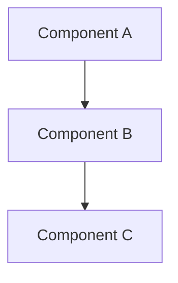

# Comparison Document Template

Use this template to synthesize architect outputs into a structured comparison. Two formats are provided: the standard comparison for divergent approaches, and the convergence shortcut when architects agree.

---

## Format 1: Standard Comparison (Divergent Approaches)

---
date: YYYY-MM-DD
research_doc: path/to/research-doc.md
requirements_doc: path/to/requirements-doc.md  # optional
status: draft
---

### Approaches Summary

| Approach Name | Summary (1 sentence) | Key Differentiator |
|---|---|---|
| Approach A | Brief description of approach A. | What makes it distinct. |
| Approach B | Brief description of approach B. | What makes it distinct. |

---

### Detailed Comparison

#### Approach A: [Name]

**Summary**: One-paragraph description of the approach.

**Key Decisions**:
- Decision 1
- Decision 2

**Component Structure**: Description of how components are organized and interact.

**Trade-offs**:
- Advantage: ...
- Disadvantage: ...

---

#### Approach B: [Name]

**Summary**: One-paragraph description of the approach.

**Key Decisions**:
- Decision 1
- Decision 2

**Component Structure**: Description of how components are organized and interact.

**Trade-offs**:
- Advantage: ...
- Disadvantage: ...

---

### Side-by-Side Comparison

| Dimension | Approach A | Approach B |
|---|---|---|
| Complexity | Low / Medium / High | Low / Medium / High |
| Reuse of existing patterns | High / Medium / Low | High / Medium / Low |
| Risk level | Low / Medium / High | Low / Medium / High |
| Requirements compliance | Full / Partial / None | Full / Partial / None |
| Maintainability | High / Medium / Low | High / Medium / Low |
| Extensibility | High / Medium / Low | High / Medium / Low |

---

### Key Differences

Prose section describing where the approaches genuinely diverge. Focus on the decisions that lead to meaningfully different code, not surface-level naming or style choices. Explain what each fork implies for implementation, testing, and future change.

---

### Requirements Compliance Summary

*(Include this section only if a requirements document was provided.)*

| Requirement | Approach A | Approach B |
|---|---|---|
| Requirement 1 | Compliant / Partial / Not met | Compliant / Partial / Not met |
| Requirement 2 | Compliant / Partial / Not met | Compliant / Partial / Not met |

---

### Recommendation

Opinionated recommendation based on the comparison above.

**Recommended: [Approach Name] because [1-2 sentence rationale explaining why this approach is the better fit for the current context and requirements].**

This recommendation acknowledges that [Approach Name] gives up [specific trade-off or capability] compared to the alternative. That trade-off is acceptable because [brief justification].

---

### Optional: Mermaid Diagrams

Include diagrams when they clarify structural or flow differences that prose cannot convey efficiently.

---

## Format 2: Convergence Shortcut (Architects Agree)

Use this format when all architects independently arrived at the same approach. Do NOT force artificial disagreement — convergence is a valid and positive outcome.

---
date: YYYY-MM-DD
research_doc: path/to/research-doc.md
status: draft
convergence: true
---

### Consensus Declaration

Strong consensus: all [N] architects converged on [approach description in one sentence].

### Minor Variations

| Architect | Variation from consensus |
|---|---|
| Architect 1 | Minor variation, if any. |
| Architect 2 | Minor variation, if any. |

### Abbreviated Comparison

Because there is strong agreement on the core approach, a full side-by-side comparison is not needed. The minor variations above do not affect the fundamental design or implementation strategy.

**Key shared decisions**:
- Decision that all architects agreed on
- Decision that all architects agreed on

### Recommendation

Recommended: [Agreed Approach] because all independent architects reached the same conclusion, reinforcing confidence in this direction. [1 sentence on why this approach is well-suited to the requirements.]
