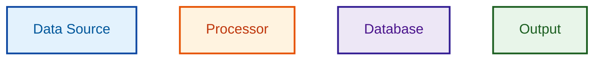
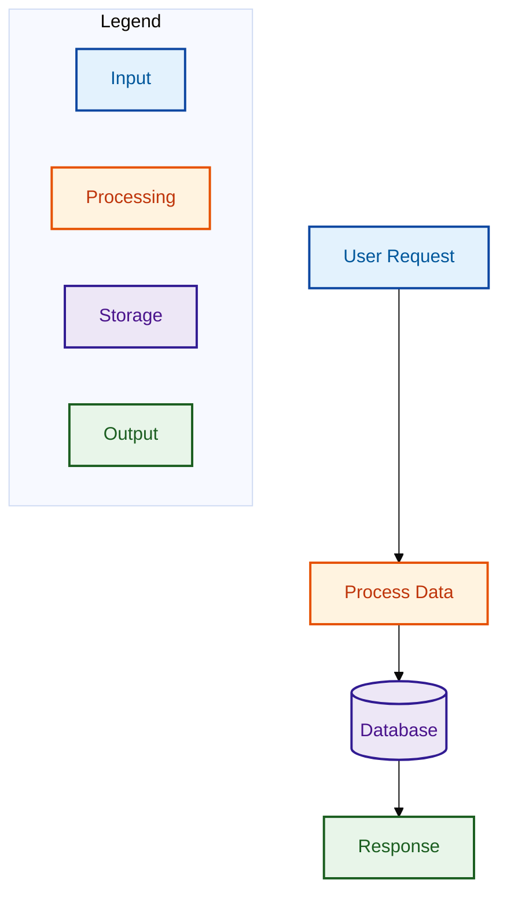

# Diagram Reference

Consolidated normative reference for the Visual Aid Reviewer agent in the document review pipeline. Absorbs the full content of the 6 diagram-standards source files: diagram-type-selection, tool-recommendations, color-palette, accessibility, legend-requirements, and colorblind-palettes.

## When to Add a Diagram

### Quantitative Heuristics

- More than 2 paragraphs needed to explain a concept
- 3 or more entities/systems interact
- 3-5 or more items to compare side-by-side
- More than 7 sequential steps in a process
- Working memory limit (~7 chunks) exceeded

### Concept Complexity Indicators

- Relationships between multiple entities
- Sequential flows with decision points
- Hierarchical or nested structures
- Spatial relationships (layout matters)
- State changes or transformations
- System architecture or component structure

### When NOT to Recommend Visuals

- When restating text without adding clarity
- When too detailed to be readable (recommend splitting instead)
- When a 3-row table or single sentence would suffice
- For purely decorative purposes

## Diagram Type Selection

| Situation                      | Recommended Visual       | Tool                         |
| ------------------------------ | ------------------------ | ---------------------------- |
| User/system journey            | Flowchart or journey map | Mermaid                      |
| Service interactions over time | Sequence diagram         | Mermaid, PlantUML            |
| System structure/components    | Component diagram        | Mermaid, PlantUML, C4        |
| State-dependent behavior       | State machine            | Mermaid, PlantUML            |
| Data model                     | ER diagram               | Mermaid (erDiagram), Erd     |
| Eventing/data movement         | Event flow, Sankey       | Mermaid                      |
| Deployment/runtime             | Deployment diagram       | PlantUML, C4                 |
| Trade-off comparison           | Decision matrix (table)  | Markdown table               |
| Business process               | Flowchart, BPMN          | Mermaid, BPMN                |
| Object-oriented design         | Class diagram            | Mermaid, PlantUML            |
| Algorithm/logic flow           | Flowchart                | Mermaid                      |
| Architecture (multi-level)     | C4 Model                 | C4-PlantUML, Structurizr     |
| Network topology               | Network diagram          | BlockDiag (NwDiag), GraphViz |
| Project timeline               | Gantt chart              | Mermaid                      |
| Hierarchical ideas             | Mindmap                  | Mermaid                      |

## Tool Selection

### Primary Tools

1. **Mermaid** - General purpose, ~23+ types incl. Radar, Treemap, Architecture, Kanban; v11.12.3 (Feb 2025). widely supported, easiest syntax
2. **PlantUML** - UML specialist, comprehensive, good for architecture; v1.2026.1 (Jan 2026), new Chart diagram type
3. **D2** - Modern syntax, great for architecture with code snippets. Still v0.x (v0.7.1, Aug 2024), release cadence slowed
4. **GraphViz** - Complex graphs, network topology, dependencies

### Specialized Tools

- **C4-PlantUML/Structurizr** - Software architecture at multiple abstraction levels; C4-PlantUML v2.13.0 (Jan 2025), new themes and modernized wireframes. Structurizr has added Python support, vNext in development
- **BPMN** - Complex business processes (international standard)
- **Erd** - Simple database ER diagrams
- **Vega-Lite** - Data visualization charts
- **Eraser.io** - DiagramGPT for AI-powered diagram generation from natural language descriptions
- **Diagrams (mingrammer)** - Python cloud infrastructure diagrams (AWS, GCP, Azure, K8s); v0.25.1

### Selection Criteria

- For general diagrams: Prefer Mermaid (easiest)
- For UML: Prefer PlantUML (industry standard)
- For architecture: Prefer C4 Model or Mermaid
- For graphs/networks: Prefer GraphViz or BlockDiag
- For databases: Prefer Mermaid erDiagram or Erd tool
- For cloud infrastructure: Consider Diagrams (Python) for programmatic generation
- For AI-assisted diagramming: Consider Eraser.io DiagramGPT

### Context-Aware Selection by Document Type

**internal docs Documentation:**

- Strongly prefer Mermaid (native MkDocs Material support, no export needed)
- Fallback to static PNG if Mermaid cannot express the diagram
- Avoid PlantUML unless UML-specific need

**RFCs (Google Docs):**

- Prefer Mermaid, PlantUML, or D2 (all work well with google-docs skill)

**Tutorials/Blog Posts:**

- Prefer simple, readable syntax (Mermaid, D2)
- Avoid overly complex tools like full PlantUML syntax

**Architecture Documentation:**

- Prefer C4 Model, PlantUML, or D2
- Consider multi-level C4 diagrams for progressive disclosure

**Print/PDF Documentation:**

- Consider SVG vs PNG rendering
- SVG recommended for scalability in print

**CONSTRAINT: Do NOT recommend Kroki's public instance (security concern -- sends data to external servers).**

## Color Palette

### Recommended Palette: Enhanced Material Design

**Note on Material Design 3 (MD3)**: Google's MD3 introduces the HCT (Hue, Chroma, Tone) color system with a 13-tone scale for more nuanced color generation. While MD3 is the future direction for Google's design systems, the MD2 50-900 scale used here remains valid and simpler for diagram coloring. Consider MD3 HCT for future-facing projects requiring dynamic color theming.

### Semantic Color Mapping

Use consistently across all diagrams:

```yaml
# Data Sources / Inputs (Blue family)
input_fill: "#E3F2FD" # Blue 50
input_stroke: "#0D47A1" # Blue 900
input_text: "#01579B" # Blue 900 alt

# Loaders / Processing / Transform (Orange family)
process_fill: "#FFF3E0" # Orange 50
process_stroke: "#E65100" # Orange 900
process_text: "#BF360C" # Deep Orange 900

# Extraction / Business Logic (Purple family)
extract_fill: "#F3E5F5" # Purple 50
extract_stroke: "#4A148C" # Purple 900
extract_text: "#311B92" # Deep Purple 900

# Converters / Control Logic (Pink family)
convert_fill: "#FCE4EC" # Pink 50
convert_stroke: "#880E4F" # Pink 900
convert_text: "#880E4F" # Pink 900

# Outputs / Results (Green family)
output_fill: "#E8F5E9" # Green 50
output_stroke: "#1B5E20" # Green 900
output_text: "#1B5E20" # Green 900

# Storage / Database (Deep Purple family)
storage_fill: "#EDE7F6" # Deep Purple 50
storage_stroke: "#311B92" # Deep Purple 900
storage_text: "#4A148C" # Purple 900

# External Systems / Infrastructure (Gray family)
neutral_fill: "#FAFAFA" # Gray 50
neutral_stroke: "#212121" # Gray 900
neutral_text: "#212121" # Gray 900

# Security / Critical (Red family)
security_fill: "#FFEBEE" # Red 50
security_stroke: "#B71C1C" # Red 900
security_text: "#B71C1C" # Red 900

# Background elements
background: "#FFFFFF" # White
border_light: "#E0E0E0" # Gray 300
```

### Mermaid classDef Templates

#### Standard Template



#### Minimal Template (for simple diagrams with 3-4 component types)

```mermaid
classDef inputClass fill:#E3F2FD,stroke:#0D47A1,color:#01579B,stroke-width:2px
classDef processClass fill:#FFF3E0,stroke:#E65100,color:#BF360C,stroke-width:2px
classDef outputClass fill:#E8F5E9,stroke:#1B5E20,color:#1B5E20,stroke-width:2px
```

### Semantic Conventions

#### By Component Type

| Component Type            | Color Family          | Use For                                               |
| ------------------------- | --------------------- | ----------------------------------------------------- |
| Data Sources / Inputs     | Blue (#0D47A1)        | External data, user input, API requests, raw data     |
| Processing / Transform    | Orange (#E65100)      | Business logic, data transformation, computation      |
| Extraction / Analysis     | Purple (#4A148C)      | Data extraction, parsing, analysis steps              |
| Converters / Control      | Pink (#880E4F)        | Format converters, routing logic, orchestration       |
| Outputs / Results         | Green (#1B5E20)       | Final results, API responses, success states          |
| Storage / Database        | Deep Purple (#311B92) | Databases, caches, persistent storage                 |
| External / Infrastructure | Gray (#212121)        | External services, infrastructure, generic components |
| Security / Critical       | Red (#B71C1C)         | Authentication, authorization, critical paths, errors |

#### By Architectural Layer

| Layer          | Color                  | Use For                              |
| -------------- | ---------------------- | ------------------------------------ |
| Presentation   | Light Blue (#BBDEFB)   | UI, frontend, user-facing components |
| Application    | Light Orange (#FFE0B2) | API layer, application logic         |
| Business Logic | Light Green (#C8E6C9)  | Core business rules, domain logic    |
| Data           | Light Purple (#E1BEE7) | Data access, persistence layer       |
| Infrastructure | Light Gray (#EEEEEE)   | Hosting, networking, deployment      |

#### By State/Status

| State              | Color           | Use For                                     |
| ------------------ | --------------- | ------------------------------------------- |
| Active/Running     | Green (#4CAF50) | Active services, running processes, success |
| Pending/Processing | Blue (#2196F3)  | In-progress, waiting, queued                |
| Warning/Attention  | Amber (#FFC107) | Warnings, caution, degraded state           |
| Error/Failed       | Red (#F44336)   | Errors, failures, critical issues           |
| Inactive/Stopped   | Gray (#9E9E9E)  | Disabled, stopped, archived                 |

## Accessibility

WCAG 2.2 became an ISO standard in 2025, superseding WCAG 2.1. The contrast ratio requirements are unchanged from 2.1, but 2.2 adds new success criteria around focus appearance and consistent help.

### Caption Requirements

- Complete sentence introducing the diagram (before the visual)
- Figure caption with end punctuation
- Self-contained (PM can understand without surrounding text)
- Conversational language, avoid jargon
- Label units and scales where applicable

### Alt Text Requirements

- Short description (<155 characters)
- Identifies what diagram shows
- Avoid "Image of" or "Diagram of"
- Consider surrounding context

### Long Description (for complex diagrams)

- Detailed textual representation
- Explain all essential information conveyed
- Describe relationships, flows, or structures shown

### Visual Design

- 4.5:1 minimum contrast ratio for text (7:1 ideal for AAA compliance)
- 3:1 minimum contrast ratio for graphical objects and UI components
- Don't rely on color alone -- use shapes, patterns, labels
- High contrast, 12pt+ text
- Consistent icon set and naming scheme

### Accessibility Compliance

All color combinations in the recommended palette meet WCAG 2.2 standards:

- Text on fill backgrounds: 7:1+ contrast ratio (AAA)
- Stroke on fill: 3:1+ contrast ratio (AA)
- Verified with WebAIM Contrast Checker

### Verification Tools

- **WebAIM Contrast Checker**: https://webaim.org/resources/contrastchecker/ -- Standard WCAG 2.2 contrast verification
- **Polypane**: Checks both WCAG 2 and APCA contrast, with built-in accessibility inspector
- **Colour Contrast Analyser (CCA)**: Desktop tool from TPGi for checking contrast against WCAG 2.2
- **Coblis Colorblind Simulator**: https://www.color-blindness.com/coblis-color-blindness-simulator/ -- Upload images to see through colorblind vision
- **DaltonLens**: More scientifically rigorous colorblind simulation based on peer-reviewed models (recommended for precise verification)

### Future Direction: APCA

The Advanced Perceptual Contrast Algorithm (APCA) is under development as part of WCAG 3.0 (Working Draft as of Sep 2025). APCA provides more perceptually accurate contrast calculations than the current WCAG 2.x luminance formula. However, WCAG 3.0 is not expected to become a standard before 2028. For now, continue using WCAG 2.2 contrast ratios as the authoritative standard.

## Legend Requirements

Every diagram with 2+ colors or shapes MUST include a legend explaining what each color and shape represents.

### Placement Options

#### 1. Mermaid Subgraph Legend (preferred for flowcharts)

```mermaid
subgraph Legend
    direction LR
    L1[Input/Data Source]:::inputClass
    L2[Processing]:::processClass
    L3[Output/Result]:::outputClass
    L4[(Database)]:::storageClass
end
```

#### 2. Mermaid Note-based Legend (for sequence diagrams)

```mermaid
Note over Legend: Color Key
Note over Legend: Blue = Input/Request
Note over Legend: Orange = Processing
Note over Legend: Green = Output/Response
```

#### 3. Separate Legend Section (markdown table)

Include a markdown table immediately after the diagram code:

```markdown
**Legend:**
| Color | Shape | Meaning |
|-------|-------|---------|
| Blue (#E3F2FD) | Rectangle | Input / Data Source |
| Orange (#FFF3E0) | Rectangle | Processing / Transform |
| Green (#E8F5E9) | Rectangle | Output / Result |
| Purple (#EDE7F6) | Cylinder | Database / Storage |
```

### Legend Content Requirements

- List ALL colors used in the diagram with their semantic meaning
- List ALL shapes used if different shapes have different meanings
- Use the same color codes as the diagram for consistency
- Keep legend entries concise (2-4 words per meaning)
- Position legend so it doesn't interfere with the main diagram flow

### Complete Example Diagram with Legend



## Colorblind-Safe Palettes

### IBM Design Language

For enterprise/minimal aesthetics:

- Primary Blue: #0F62FE (fill: #EDF5FF, text: #0043CE)
- Success Green: #24A148 (fill: #DEFBE6, text: #0E6027)
- Warning Yellow: #F1C21B (fill: #FCF4D6, text: #8E6A00)
- Error Red: #DA1E28 (fill: #FFE0E0, text: #A2191F)
- Neutral Gray: #525252 (fill: #F4F4F4, text: #161616)

### Okabe-Ito Colorblind-Safe Palette

For maximum accessibility (distinguishable for all colorblind types):

- Blue: #0072B2, Orange: #E69F00, Bluish Green: #009E73
- Vermilion: #D55E00, Sky Blue: #56B4E9, Reddish Purple: #CC79A7
- Yellow: #F0E442, Black: #000000

This palette was designed by Masataka Okabe and Kei Ito and published on the J-Fly website. It is the most widely cited colorblind-safe palette in scientific literature.

### Paul Tol Palettes

For scientific and data visualization contexts:

**Qualitative scheme** (up to 12 distinct colors):

- #4477AA, #EE6677, #228833, #CCBB44, #66CCEE, #AA3377, #BBBBBB

**Diverging scheme** (for heatmaps and scales):

- Blue-to-Red: #364B9A -> #EAECCC -> #A50026

Paul Tol's schemes are specifically optimized for colorblind accessibility and verified against all major types of color vision deficiency.

### Monochromatic

For print-friendly diagrams:

- Use single-hue progression (e.g., Blue 50 -> Blue 900)
- Ensure sufficient lightness contrast between adjacent elements
- Add patterns and shapes for additional differentiation

## Diagram Rewriting Criteria

When to rewrite an existing diagram rather than leaving it as-is:

- **Excessive complexity**: >20 nodes making the diagram hard to follow
- **Crossing edges**: Lines cross each other, obscuring the flow
- **Missing accessibility text**: No alt text, legend, or caption present
- **Outdated styling**: Does not use semantic colors from the palette
- **Poor layout**: Overlapping nodes, cramped spacing, unclear direction
- **Missing WCAG compliance**: Color contrast violations, color as sole differentiator

Rewriting should:

- Improve layout clarity and reduce edge crossings
- Apply semantic colors from the recommended palette
- Add accessibility attributes (alt text, legend, caption)
- Split overly complex diagrams into focused sub-diagrams when >20 nodes

## Styling Best Practices

**DO:**

- Use semantic color mapping consistently across all diagrams
- Limit palette to 5-7 distinct colors per diagram
- Use stroke-width:2px for all nodes (consistency)
- Include text labels in addition to colors
- Test critical color combinations with contrast checker
- Use 900-level Material Design colors for text (not generic dark gray)
- Include a legend for every diagram with 2+ colors or shapes

**DON'T:**

- Mix red and green for adjacent components (colorblind issue)
- Use color as the only information carrier
- Use pure black (#000000) for text (can be harsh -- use #212121)
- Exceed 7 colors in a single diagram
- Use custom colors without verifying WCAG contrast ratios
- Omit legend when diagram uses multiple colors or shapes
